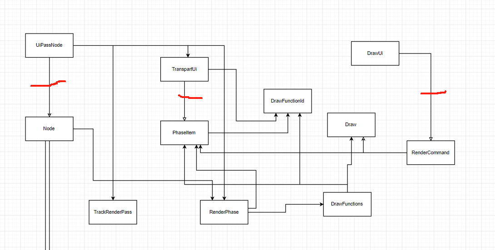

+++
title = "论bevy render的设计"
date = 2024-01-24

[taxonomies]
tags = ["bevy", "rust"]
+++

bevy是一个rust的开源游戏引擎，在社区备受关注。本篇文章立足bevy render库探究render渲染器的设计。

<!-- more -->

# 一句话总结bevy render库的功能
渲染图工作器推动渲染图中的每个节点使用自己的绘制函数将cpu数据转化gpu数据，然后将gpu数据传输给gpu。
这句话有两个重要的行为：
- 每个节点使用自己的绘制函数将cpu数据转化gpu数据。
- 把gpu数据传输给gpu。

理解第一个行为可以自定义渲染内容。
理解第二个行为可以自定义渲染后端。

在大多数情况下我们只关心如何自定义渲染内容，所有我们会更多的介绍第一个行为。

# 如何定义一个渲染图中的节点

在bevy的源代码库中我们可以全局搜索 impl Node 这几个关键字，我们能够比较精确的看到已经实现的节点。从搜索的关键字我们就可以得到，node 是一个trait。当然通过trait实现抽象也在意料之中。trait的定义如下:

``` rust
pub trait Node: Downcast + Send + Sync + 'static {
    /// Specifies the required input slots for this node.
    /// They will then be available during the run method inside the [`RenderGraphContext`].
    fn input(&self) -> Vec<SlotInfo> {
        Vec::new()
    }

    /// Specifies the produced output slots for this node.
    /// They can then be passed one inside [`RenderGraphContext`] during the run method.
    fn output(&self) -> Vec<SlotInfo> {
        Vec::new()
    }

    /// Updates internal node state using the current render [`World`] prior to the run method.
    fn update(&mut self, _world: &mut World) {}

    /// Runs the graph node logic, issues draw calls, updates the output slots and
    /// optionally queues up subgraphs for execution. The graph data, input and output values are
    /// passed via the [`RenderGraphContext`].
    fn run(
        &self,
        graph: &mut RenderGraphContext,
        render_context: &mut RenderContext,
        world: &World,
    ) -> Result<(), NodeRunError>;
}
```
node最为重要的函数为run函数，我们可以看到，它使用了二个可变的对象，RenderGraphContext和RenderContext。从名称也可以得知这个两个对象的作用，一个是渲染图上下文，一个是渲染上文。从这个函数定义可以看到，只要我们实现了这个trait，我们其实就可以自定义渲染内容，但是这个实现还太底层，我们需要明白gpu需要一系列的数据，才能更好的操作。直接使用这个还是一头雾水。所以需要从源码看一个实现，才能更好的理解。
# bevy ui UiPassNode
UiPassNode的定义如下:

``` rust
pub struct UiPassNode {
    ui_view_query: QueryState<
        (
            &'static RenderPhase<TransparentUi>,
            &'static ViewTarget,
            &'static ExtractedCamera,
        ),
        With<ExtractedView>,
    >,
    default_camera_view_query: QueryState<&'static DefaultCameraView>,
}
```
UiPass的node实现如下:
``` rust
impl Node for UiPassNode {
    fn update(&mut self, world: &mut World) {
        self.ui_view_query.update_archetypes(world);
        self.default_camera_view_query.update_archetypes(world);
    }

    fn run(
        &self,
        graph: &mut RenderGraphContext,
        render_context: &mut RenderContext,
        world: &World,
    ) -> Result<(), NodeRunError> {
        let input_view_entity = graph.view_entity();

        let Ok((transparent_phase, target, camera)) =
            self.ui_view_query.get_manual(world, input_view_entity)
        else {
            return Ok(());
        };
        if transparent_phase.items.is_empty() {
            return Ok(());
        }

        // use the "default" view entity if it is defined
        let view_entity = if let Ok(default_view) = self
            .default_camera_view_query
            .get_manual(world, input_view_entity)
        {
            default_view.0
        } else {
            input_view_entity
        };
        let mut render_pass = render_context.begin_tracked_render_pass(RenderPassDescriptor {
            label: Some("ui_pass"),
            color_attachments: &[Some(target.get_unsampled_color_attachment())],
            depth_stencil_attachment: None,
            timestamp_writes: None,
            occlusion_query_set: None,
        });
        if let Some(viewport) = camera.viewport.as_ref() {
            render_pass.set_camera_viewport(viewport);
        }
        transparent_phase.render(&mut render_pass, world, view_entity);

        Ok(())
    }
}
```
这里面最重要的逻辑就是下面这句：
```rust
transparent_phase.render(&mut render_pass, world, view_entity);
```

transparent_phase是一个泛型，由PhaseItem trait约束，在这里它实际的类型是RenderPhase<TransparentUi>。render_pass是TrackedRenderPass的实例，它用于设置管道，顶点等gpu需要的数据。
一句话总结，node的具体实现依赖于实现了PhaseItem trait的泛型RenderPhase<TransparentUi>。这里我们需要探究RenderPhase和PhaseItem trait的作用。
transparent_phase.render的实现如下:
```rust
pub fn render<'w>(
    &self,
    render_pass: &mut TrackedRenderPass<'w>,
    world: &'w World,
    view: Entity,
) {
    self.render_range(render_pass, world, view, ..);
}

pub fn render_range<'w>(
    &self,
    render_pass: &mut TrackedRenderPass<'w>,
    world: &'w World,
    view: Entity,
    range: impl SliceIndex<[I], Output = [I]>,
) {
    let items = self
        .items
        .get(range)
        .expect("`Range` provided to `render_range()` is out of bounds");

    let draw_functions = world.resource::<DrawFunctions<I>>();
    let mut draw_functions = draw_functions.write();
    draw_functions.prepare(world);

    let mut index = 0;
    while index < items.len() {
        let item = &items[index];
        let batch_range = item.batch_range();
        if batch_range.is_empty() {
            index += 1;
        } else {
            let draw_function = draw_functions.get_mut(item.draw_function()).unwrap();
            draw_function.draw(world, render_pass, view, item);
            index += batch_range.len();
        }
    }
}

```
transparent_phase 从DrawFunction中取出draw_functions,根据PhaseItem取出id，由id获取渲染函数，渲染函数负责具体的绘制。
这里我们还不清楚是渲染函数怎么和PhaseItem联系起来。渲染函数同样是实现了draw trait的对象。bevy引入了一个另一个trait自动实现draw，并且通过这个trait将PhaseItem联系起来，这个trait就是RenderCommand<P: PhaseItem>。我们可以看下bevy ui render具体的实现。
```rust
pub type DrawUi = (
    SetItemPipeline,
    SetUiViewBindGroup<0>,
    SetUiTextureBindGroup<1>,
    DrawUiNode,
);

pub struct SetUiViewBindGroup<const I: usize>;
impl<P: PhaseItem, const I: usize> RenderCommand<P> for SetUiViewBindGroup<I> {
    type Param = SRes<UiMeta>;
    type ViewQuery = Read<ViewUniformOffset>;
    type ItemQuery = ();

    fn render<'w>(
        _item: &P,
        view_uniform: &'w ViewUniformOffset,
        _entity: (),
        ui_meta: SystemParamItem<'w, '_, Self::Param>,
        pass: &mut TrackedRenderPass<'w>,
    ) -> RenderCommandResult {
        pass.set_bind_group(
            I,
            ui_meta.into_inner().view_bind_group.as_ref().unwrap(),
            &[view_uniform.offset],
        );
        RenderCommandResult::Success
    }
}
pub struct SetUiTextureBindGroup<const I: usize>;
impl<P: PhaseItem, const I: usize> RenderCommand<P> for SetUiTextureBindGroup<I> {
    type Param = SRes<UiImageBindGroups>;
    type ViewQuery = ();
    type ItemQuery = Read<UiBatch>;

    #[inline]
    fn render<'w>(
        _item: &P,
        _view: (),
        batch: &'w UiBatch,
        image_bind_groups: SystemParamItem<'w, '_, Self::Param>,
        pass: &mut TrackedRenderPass<'w>,
    ) -> RenderCommandResult {
        let image_bind_groups = image_bind_groups.into_inner();
        pass.set_bind_group(I, image_bind_groups.values.get(&batch.image).unwrap(), &[]);
        RenderCommandResult::Success
    }
}
pub struct DrawUiNode;
impl<P: PhaseItem> RenderCommand<P> for DrawUiNode {
    type Param = SRes<UiMeta>;
    type ViewQuery = ();
    type ItemQuery = Read<UiBatch>;

    #[inline]
    fn render<'w>(
        _item: &P,
        _view: (),
        batch: &'w UiBatch,
        ui_meta: SystemParamItem<'w, '_, Self::Param>,
        pass: &mut TrackedRenderPass<'w>,
    ) -> RenderCommandResult {
        pass.set_vertex_buffer(0, ui_meta.into_inner().vertices.buffer().unwrap().slice(..));
        pass.draw(batch.range.clone(), 0..1);
        RenderCommandResult::Success
    }
}

```
这里的DrawUi就是实际的绘制函数实现。好，我们这里已经弄清楚node 的具体实现，这里我们总结一下这个流程。
- node trait 靠实现了PhaseItem的RenderPhase<T>的驱动。
- RenderPhase<T> 从DrawFunction<T>获得具体的渲染函数。
- 渲染函数由RenderCommand<T>定义。
- 每个RenderCommand负责向gpu发送数据。

对应beve ui render就是
- UiPassNode 靠RenderPhase<TransparentUi>驱动
- RenderPhase<TransparentUi> 从DrawFunction<TransparentUi>获得具体的渲染函数
- DrawUi为实际的渲染函数，
- SetItemPipeline，SetUiViewBindGroup，SetUiTextureBindGroup，DrawUiNode负责向gpu发送数据
# bevy ui plugin
通过bevy ui plugin可以看下具体的实现。代码如下:

```rust
pub fn build_ui_render(app: &mut App) {
    load_internal_asset!(app, UI_SHADER_HANDLE, "ui.wgsl", Shader::from_wgsl);

    let Ok(render_app) = app.get_sub_app_mut(RenderApp) else {
        return;
    };

    render_app
        .init_resource::<SpecializedRenderPipelines<UiPipeline>>()
        .init_resource::<UiImageBindGroups>()
        .init_resource::<UiMeta>()
        .init_resource::<ExtractedUiNodes>()
        .allow_ambiguous_resource::<ExtractedUiNodes>()
        .init_resource::<DrawFunctions<TransparentUi>>()
        .add_render_command::<TransparentUi, DrawUi>()
        .add_systems(
            ExtractSchedule,
            (
                extract_default_ui_camera_view::<Camera2d>,
                extract_default_ui_camera_view::<Camera3d>,
                extract_uinodes.in_set(RenderUiSystem::ExtractNode),
                extract_uinode_borders.after(RenderUiSystem::ExtractAtlasNode),
                #[cfg(feature = "bevy_text")]
                extract_text_uinodes.after(RenderUiSystem::ExtractAtlasNode),
                extract_uinode_outlines.after(RenderUiSystem::ExtractAtlasNode),
            ),
        )
        .add_systems(
            Render,
            (
                queue_uinodes.in_set(RenderSet::Queue),
                sort_phase_system::<TransparentUi>.in_set(RenderSet::PhaseSort),
                prepare_uinodes.in_set(RenderSet::PrepareBindGroups),
            ),
        );
   
}

```
在ui plugin中可以看到手动添加了DrawFunctions资源和TransparentUi，DrawUi的rendercommand。
# 简陋架构图

图中红线为我们实现自定义渲染需要自己实现的trait。
# 结语
该文章并未涉及从ecs中获取组件数据和渲染app的相关解释。