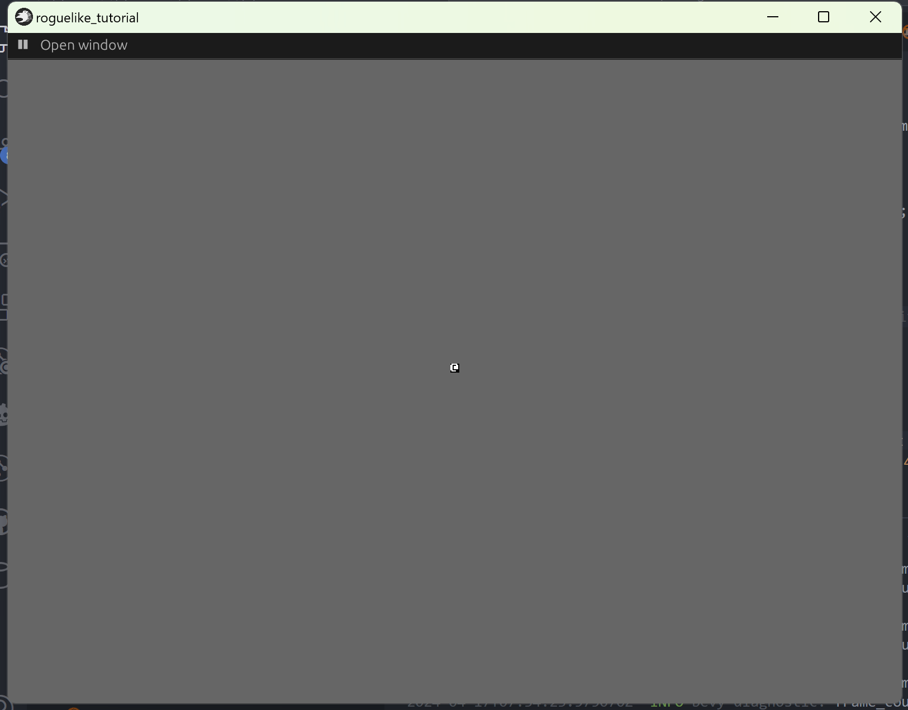

+++
title = "roguelike_chapter1 实体和组件"
date = 2024-01-24

[taxonomies]
tags = ["roguelike", "bevy"]
+++

[bracketproductions](https://bfnightly.bracketproductions.com)的 bevy 实现。
代码仓库: [RoguelikeTutorial](https://github.com/zuiyu1998/RoguelikeTutorial.git)

<!-- more -->

# 在屏幕上显示人物

在 src/consts.rs 中声明 sprite 大小。代码如下:

```rust
pub const SPRITE_SIZE: [usize; 2] = [8, 8];
```

SPRITE_SIZE 表示在屏幕中渲染 sprite 的大小。
在 src/loading.rs 中 TextureAssets 中新增一个字段 terminal，这个字段为游戏用到图片资源的索引。代码如下：

```rust
#[derive(AssetCollection, Resource)]
pub struct TextureAssets {
    #[asset(path = "textures/bevy.png")]
    pub bevy: Handle<Image>,
    #[asset(path = "textures/github.png")]
    pub github: Handle<Image>,
    #[asset(path = "textures/terminal8x8.png")]
    pub terminal: Handle<Image>,
}
```

在 src/render.rs 中新增 create_sprite_sheet_bundle 函数，这个函数用来生成在屏幕上显示的 sprite_sheet_bundle，代码如下:

```rust
pub fn create_sprite_sheet_bundle(
    texture_assets: &TextureAssets,
    layout_assets: &mut Assets<TextureAtlasLayout>,
    index: usize,
) -> SpriteSheetBundle {
    let layout = TextureAtlasLayout::from_grid(
        Vec2::new(SPRITE_SIZE[0] as f32, SPRITE_SIZE[1] as f32),
        16,
        16,
        None,
        None,
    );

    SpriteSheetBundle {
        sprite: Sprite {
            custom_size: Some(Vec2::new(SPRITE_SIZE[0] as f32, SPRITE_SIZE[1] as f32)),
            ..Default::default()
        },
        atlas: TextureAtlas {
            layout: layout_assets.add(layout),
            index,
        },
        texture: texture_assets.terminal.clone(),
        ..Default::default()
    }
}


```

在 src/logic.rs 中新增 LogicPlugin，在 LogicPlugin 添加 setup_game 系统，代码如下:

```rust
pub struct LogicPlugin;

impl Plugin for LogicPlugin {
    fn build(&self, app: &mut App) {
        app.add_systems(OnEnter(GameState::Playing), (setup_game,));
    }
}

fn setup_game(
    mut commands: Commands,
    texture_assets: Res<TextureAssets>,
    mut layout_assets: ResMut<Assets<TextureAtlasLayout>>,
) {
    let sprite_bundle = create_sprite_sheet_bundle(&texture_assets, &mut layout_assets, 64);

    commands.spawn(sprite_bundle);
}
```

setup_game 系统利用 create_sprite_sheet_bundle 生成了一个 sprite bundle 用来显示。这里玩家的索引为 64。
此时运行程序，显示的界面如下。


# 为人物添加位置

在 src/commom.rs 中添加 Position 组件，表明其所在的位置。Position 声明如下:

```
#[derive(Component)]
pub struct Position {
    x: i32,
    y: i32,
}
```

将 Position 的位置同步到坐标系统中，新增一个 keep_position 系统。代码如下:

```rust
fn keep_position(mut q_position: Query<(&Position, &mut Transform), Or<(Changed<Position>,)>>) {
    for (pos, mut tran) in q_position.iter_mut() {
        let pos = Vec2::new(
            (pos.x * SPRITE_SIZE[0] as i32) as f32,
            (pos.y * SPRITE_SIZE[1] as i32) as f32,
        );

        tran.translation = pos.extend(tran.translation.z);
    }
}

```

同时新增一个 CommonPlugin，代码如下:

```rust
pub struct CommonPlugin;

impl Plugin for CommonPlugin {
    fn build(&self, app: &mut App) {
        app.add_systems(PreUpdate, (keep_position,));
    }
}

```

不要忘记将 CommonPlugin 放入 src/lib.rs 的 GamePlugin 中。
在 src/logic.rs 的 setup_game 系统中添加 Position 组件。代码如下:

```rust
fn setup_game(
    mut commands: Commands,
    texture_assets: Res<TextureAssets>,
    mut layout_assets: ResMut<Assets<TextureAtlasLayout>>,
) {
    let sprite_bundle = create_sprite_sheet_bundle(&texture_assets, &mut layout_assets, 64);

    commands.spawn((sprite_bundle, Position { x: 1, y: 1 }));
}
```

为 Position 组件派生 Reflect，并注册到 bevy app 中，代码如下:

```rust
#[derive(Component, Reflect)]
#[reflect(Component)]
pub struct Position {
    pub x: i32,
    pub y: i32,
}


impl Plugin for CommonPlugin {
    fn build(&self, app: &mut App) {
        app.register_type::<Position>();

        app.add_systems(PreUpdate, (keep_position,));
    }
}

```

# 让玩家动起来

在 src/player.rs 中新增一个组件 Player，用来标识玩家。代码如下:

```rust
#[derive(Component)]
pub struct Player;

```

新增一个 player_input 系统来监控用户输入，在按键按下的时候移动玩家。代码如下:

```rust
fn get_input(keyboard_input: &ButtonInput<KeyCode>) -> Vec2 {
    let mut input = Vec2::ZERO;

    if keyboard_input.just_pressed(KeyCode::KeyW) {
        input.y += 1.0;
    }

    if keyboard_input.just_pressed(KeyCode::KeyS) {
        input.y -= 1.0;
    }

    if keyboard_input.just_pressed(KeyCode::KeyD) {
        input.x += 1.0;
    }

    if keyboard_input.just_pressed(KeyCode::KeyA) {
        input.x -= 1.0;
    }

    input
}

pub fn player_input(
    keyboard_input: Res<ButtonInput<KeyCode>>,
    mut q_player: Query<&mut Position, With<Player>>,
) {
    let mut pos = match q_player.get_single_mut() {
        Ok(pos) => pos,
        Err(_) => return,
    };

    let input = get_input(&keyboard_input);

    pos.x += input.x as i32;
    pos.y += input.y as i32;
}
```

新增一个 PlayerPlugin，代码如下:

```rust
pub struct PlayerPlugin;

impl Plugin for PlayerPlugin {
    fn build(&self, app: &mut App) {
        app.add_systems(PreUpdate, (player_input,));
    }
}
```

在 src/logic.rs 的 setup_game 系统中添加 Player 组件。运行程序，玩家已经可以动起来了。

# 添加可视化编辑器

在 Cargo.toml 的文件内添加如下代码:

```rust
bevy_editor_pls = { version = "0.8", optional = true }

```

features 改为如下所示：

```rust
[features]
default = ['dev']
dev = ["bevy/dynamic_linking", "bevy_editor_pls"]

```

在 src/dev.rs 中添加如下代码:

```rust
use bevy::diagnostic::{FrameTimeDiagnosticsPlugin, LogDiagnosticsPlugin};
use bevy_editor_pls::EditorPlugin;

use bevy::prelude::*;

pub struct DevPlugin;

impl Plugin for DevPlugin {
    fn build(&self, app: &mut App) {
        app.add_plugins((
            FrameTimeDiagnosticsPlugin,
            LogDiagnosticsPlugin::default(),
            EditorPlugin::new(),
        ));
    }
}

```

在 src/lib.rs 中使 DevPlugin 只在 dev feature 中启用。代码如下:

```rust
 #[cfg(feature = "dev")]
{
    use dev::DevPlugin;

    app.add_plugins(DevPlugin);
}
```

# 致谢

- [bevy](https://github.com/bevyengine/bevy),游戏引擎
- [bevy_game_template](https://github.com/NiklasEi/bevy_game_template.git),游戏模板
- [bevy_editor_pls](https://github.com/jakobhellermann/bevy_editor_pls),可视化编辑器
