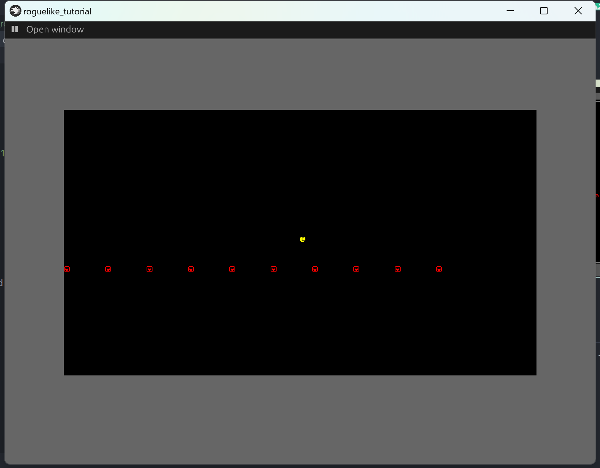

+++
title = "roguelike_chapter1 实体和组件"
date = 2024-01-24

[taxonomies]
tags = ["roguelike", "bevy"]
+++

[bracketproductions](https://bfnightly.bracketproductions.com)的 bevy 实现。
代码仓库: [RoguelikeTutorial](https://github.com/zuiyu1998/RoguelikeTutorial.git)

<!-- more -->

# 添加渲染 plugin

rltk 提供了很多默认的东西，有些在 bevy 并没有默认实现，需要求助第三方的库，好在实现类似效果的最三方库是存在的，那就是[bevy_ascii_terminal](https://github.com/sarkahn/bevy_ascii_terminal)。

在 src/render/mod.rs 中新建一个 InternalRenderPlugin。代码如下。

```rust
pub struct InternalRenderPlugin;

impl Plugin for InternalRenderPlugin {
    fn build(&self, app: &mut App) {
        app.add_plugins((TerminalPlugin,));
    }
}
```

在 src/lib.rs 中 GamePlugin 中添加 InternalRenderPlugin,代码如下:

```rust
app.init_state::<GameState>().add_plugins((
        LoadingPlugin,
        MenuPlugin,
        InternalAudioPlugin,
        InternalRenderPlugin,
    ));
```

其中 TerminalPlugin 为 bevy_ascii_terminal 提供的 plugin。bevy_ascii_terminal 中需要注意的抽象为 Terminal，它是类似终端字符面板的抽象。通过 push_char 方法 可以更改 Terminal 的内容。它的声明如下:

```rust
pub fn put_char(&mut self, xy: impl GridPoint, writer: impl TileFormatter)
```

xy 是位置参数,writer 为实际显示的数据，通过实现这两个 trait，就可以方便的更改要显示的内容。

> plugin 是 bevy 模块化的 trait，整个 bevy 引擎就是若干个 plugin 组合起来的。

# 定义一个位置(Position)组件

在 src/render/mod.rs 中新建一个 Position 结构体。Position 的 x,y 将表示物体在屏幕中的位置。

```rust
#[derive(Component, Debug, Clone, Copy)]
pub struct Position {
    pub x: i32,
    pub y: i32,
}
```

为 Position 实现 GridPoint trait，以便可以作为 push_char 的参数。代码如下:

```rust
impl GridPoint for Position {
    fn x(&self) -> i32 {
        self.x
    }

    fn y(&self) -> i32 {
        self.y
    }

    fn get_pivot(self) -> Option<Pivot> {
        None
    }
}

```

> #[derive(Component)] 这是 bevy 标记组件的派生宏，我们可以自定义 Component trait，但是大多数情况下使用派生宏就够了。

# 定义一个渲染(Renderable)组件

在 src/character/mod.rs 中新建一个 Renderable 结构体。Renderable 并不控制渲染，它是渲染所需数据的单元。fg_color 和 bg_color 表示样式,glyph 表示渲染的字符。它的定义如下:

```rust
#[derive(Component, Debug)]
pub struct Renderable {
    pub fg_color: Color,
    pub bg_color: Color,
    pub glyph: char,
}
```

为 FormattedTile 实现 From<Renderable> trait，以便可以作为 push_char 的参数。代码如下:

```rust
impl From<Renderable> for FormattedTile {
    fn from(value: Renderable) -> Self {
        FormattedTile::default()
            .glyph(value.glyph)
            .fg(value.fg_color)
            .bg(value.bg_color)
    }
}
```

注意这里的 FormattedTile 为 bevy_ascii_terminal 已经实现了 TileFormatter 的类型。

# 创建实体

批量添加多个实体，代码如下:

```rust
pub fn spawn_character(mut commands: Commands) {
    for i in 0..10 {
        commands.spawn_empty().insert((
            Position { x: i * 7, y: 20 },
            Renderable {
                glyph: '☺',
                fg: Color::RED,
                bg: Color::BLACK,
            },
        ));
    }

    commands.spawn_empty().insert((
        Position { x: 40, y: 25 },
        Renderable {
            glyph: '@',
            fg: Color::YELLOW,
            bg: Color::BLACK,
        },
    ));
}
```

不要忘记将 system 加入到 app 中，不然不会有效果。

```rust
impl Plugin for InternalRenderPlugin {
    fn build(&self, app: &mut App) {
        app.add_plugins((TerminalPlugin,));

        app.add_systems(OnEnter(GameState::Playing), spawn_character);
    }
}
```

> add_systems 的第一个参数为 stage，第二个参数为系统，stage 有 bevy 提供的默认实现，也有用户自定义的 stage。

此时已经可以运行程序，但是还什么都看不到,我们可以添加一个工具来可视化我们的某些操作。

# 添加一个可视化的编辑器

bevy_editor_pls 是社区现在一个可用的可视化编辑器，它可以实时的观察 bevy app 的一些状态。引入 bevy_editor_pls 会极大的方便我们的开发。

在./Cargo.toml 文件的依赖下添加如下一行:

```rust
bevy_editor_pls = { version = "0.8", optional = true }

```

这里使用 optional 字段是因为要使用 features 分离正式环境和开发环境。
在同文件的 features 下添加如下代码:

```rust
default = ['dev']
dev = ["bevy/dynamic_linking", "bevy_editor_pls"]
```

在这里定义了一个 dev 的 feature，将开发环境用的一些工具库可以隔离在 dev 下。同时默认 feature 启用 dev，方便开发。

新增 src/dev.rs，同时将 debug cfg 的代码删除。在 dev.rs 中新增 DevPlugin。代码如下:

```rust
pub struct DevPlugin;

impl Plugin for DevPlugin {
    fn build(&self, app: &mut App) {
        app.add_plugins((FrameTimeDiagnosticsPlugin, LogDiagnosticsPlugin::default()));
    }
}

```

FrameTimeDiagnosticsPlugin,LogDiagnosticsPlugin 是用来统计帧数的工具。在 bevy_editor_pls 中同样会使用。

将 DevPlugin 放到 src/lib.rs 的 GamePlugin 中就可以正常使用了。代码如下:

```rust
#[cfg(feature = "dev")]
{
    use dev::DevPlugin;

    app.add_plugins(DevPlugin);
}

```

注意这个 cfg，这个一定要添加，这个是 rust 的条件编译。
最后添加 bevy_editor_pls 在 src/dev.rs 的 DevPlugin 中，代码如下:

```rust
impl Plugin for DevPlugin {
    fn build(&self, app: &mut App) {
        app.add_plugins((
            FrameTimeDiagnosticsPlugin,
            LogDiagnosticsPlugin::default(),
            EditorPlugin::default(),
        ));
    }
}
```

运行代码可以看到如下的界面。


# 在屏幕上显示字符

在 src/render/mod.rs 中添加一个 spawn_terminal 函数,这个函数为生成一个 Terminal，放入 ecs 中，代码如下:

```rust

pub fn spawn_terminal(mut commands: Commands) {
    let terminal = Terminal::new([80, 50]).with_border(Border::single_line());

    commands.spawn((
        // Spawn the terminal bundle from our terminal
        TerminalBundle::from(terminal),
        // Automatically set up the camera to render the terminal
        Name::new("Terminal"),
    ));
}
```

同时添加一个 render 系统，将 Position 和 Renderable 的数据添加到 Terminal 中，代码如下:

```rust
pub fn render(
    q_q_position_and_renderable: Query<(&Position, &Renderable)>,
    mut q_render_terminal: Query<&mut Terminal>,
) {
    let mut term = match q_render_terminal.get_single_mut() {
        Ok(term) => term,
        Err(_) => return,
    };
    term.clear();

    q_q_position_and_renderable
        .iter()
        .for_each(|(position, renderable)| {
            let tile: FormattedTile = renderable.clone().into();

            term.put_char(position.clone(), tile);
        });
}

```

最后添加一个专门的相机用来显示 Terminal,替换 src/menu 下生成 Camera2dBundle 的代码,该代码如下:

```rust

commands.spawn(
        TiledCameraBundle::new()
            .with_pixels_per_tile([8, 8])
            .with_tile_count([80, 45]),
    );
```

将所有系统添加到 InternalRenderPlugin 中，代码如下:

```rust

impl Plugin for InternalRenderPlugin {
    fn build(&self, app: &mut App) {
        app.add_plugins((TerminalPlugin,));

        app.add_systems(
            OnEnter(GameState::Playing),
            (spawn_character, spawn_terminal),
        );
        app.add_systems(Update, (render,));
    }
}
```

运行代码，右键左上角的按钮，点击 playing，右键左上角的按钮，会出现下图界面。


# 添加一个自动移动系统

在 src/render/mod.rs 中添加一个新的组件 LeftMover,代码如下:

```rust

#[derive(Component)]
struct LeftMover {}
```

为这个组件添加一个移动系统 left_movement。代码如下:

```rust

pub fn left_movement(mut q_position: Query<(&mut Position,), With<LeftMover>>) {
    for (mut position,) in q_position.iter_mut() {
        position.x -= 1;

        if position.x < 0 {
            position.x = 79;
        }
    }
}
```

Query 有两个泛型参数，第一个是指定数据，第二个指定条件。left_movement 的 q_position 表示的是从同时有 LeftMover 和 Position 组件的实体中获取 Position 的数据。
将这个系统添加到 plugin 中，代码如下:

```rust

impl Plugin for InternalRenderPlugin {
    fn build(&self, app: &mut App) {
        app.add_plugins((TerminalPlugin,));

        app.add_systems(
            OnEnter(GameState::Playing),
            (spawn_character, spawn_terminal),
        );
        app.add_systems(Update, (render,));
        app.add_systems(
            FixedUpdate,
            left_movement.run_if(in_state(GameState::Playing)),
        );
    }
}
```

FixedUpdate,是类似于 update 的 stage。但不是每一帧都运行系统，而是按照一定频率运行的系统。

# 添加一个玩家组件并且监听用户输入

在 src/render/mod.rs 中新增一个 Player 组件。代码如下:

```rust

#[derive(Component)]
pub struct Player {}

```

在创建实体时，添加 player 组件。代码如下:

```rust

commands.spawn_empty().insert((
        Position { x: 40, y: 25 },
        Renderable {
            glyph: '@',
            fg: Color::YELLOW,
            bg: Color::BLACK,
        },
        Player {},
    ));
```

为 Position 添加一个 movement 方法，代码如下:

```rust
impl Position {
    pub fn movement(&mut self, delta_x: i32, delta_y: i32) {
        self.x = 79.min(0.max(self.x + delta_x));
        self.y = 79.min(0.max(self.y + delta_y));
    }
}

```

添加一个监听用户输入，并使玩家移动的系统 user_input。代码如下:

```rust
pub fn user_input(
    keyboard_input: Res<ButtonInput<KeyCode>>,
    mut q_player: Query<&mut Position, With<Player>>,
) {
    let mut x = 0;
    let mut y = 0;

    if keyboard_input.just_pressed(KeyCode::KeyA) {
        x -= 1;
    }

    if keyboard_input.just_pressed(KeyCode::KeyD) {
        x += 1;
    }

    if keyboard_input.just_pressed(KeyCode::KeyW) {
        y += 1;
    }

    if keyboard_input.just_pressed(KeyCode::KeyS) {
        y -= 1;
    }

    for mut position in q_player.iter_mut() {
        position.movement(x, y);
    }
}

```

运行代码，右键左上角的按钮，点击 playing，右键左上角的按钮，会出现下图界面。


使用键盘的 wasd 可以使玩家移动。

# 致谢

- [bevy](https://github.com/bevyengine/bevy),游戏引擎
- [bevy_game_template](https://github.com/NiklasEi/bevy_game_template.git),游戏模板
- [bevy_ascii_terminal](https://github.com/sarkahn/bevy_ascii_terminal),字符显示
- [bevy_editor_pls](https://github.com/jakobhellermann/bevy_editor_pls),可视化编辑器
