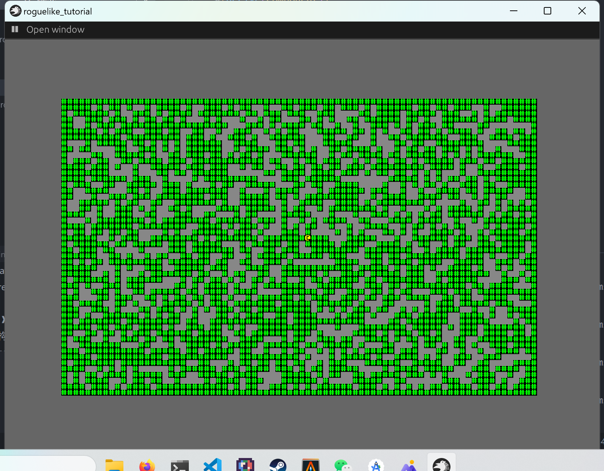

+++
title = "roguelike_chapter2 地图"
date = 2024-01-24

[taxonomies]
tags = ["roguelike", "bevy"]
+++

[bracketproductions](https://bfnightly.bracketproductions.com)的 bevy 实现。
代码仓库: [RoguelikeTutorial](https://github.com/zuiyu1998/RoguelikeTutorial.git)

<!-- more -->

# 定义地图类型

在 src/map.rs 中新增一个 enum TileType 来声明地图类型，代码如下:

```rust
#[derive(PartialEq, Copy, Clone)]
pub enum TileType {
    Wall,
    Floor,
}
```

派生的 PartialEq trait 用于使用=运算符。
定义一个地图 Map，代码如下：

```rust
#[derive(Resource)]
pub struct Map {
    pub width: i32,
    pub height: i32,
    pub tiles: Vec<TileType>,
}

```

width 和 height 表示地图大小，tiles 表示地图中的数据。派生的 Resource 表明这是一个资源。

新增一个函数用获取地图数据的索引。代码如下：

```rust
 pub fn xy_idx(&self, x: i32, y: i32) -> usize {
        (y as usize * self.width as usize) + x as usize
    }

```

为 map 实现 new 方法，构建 map 对象。代码如下:

```rust
impl Map {
pub fn new(width: i32, height: i32) -> Map {
        let width_u = width as usize;
        let height_u = height as usize;

        let tiles = vec![TileType::Floor; width_u * height_u];

        let mut map = Map {
            width,
            height,
            tiles,
        };

        // Make the boundaries walls
        for x in 0..width {
            let index = map.xy_idx(x, 0);
            map.tiles[index] = TileType::Wall;

            let index = map.xy_idx(x, height - 1);
            map.tiles[index] = TileType::Wall;
        }
        for y in 0..height {
            let index = map.xy_idx(0, y);
            map.tiles[index] = TileType::Wall;

            let index = map.xy_idx(width - 1, y);

            map.tiles[index] = TileType::Wall;
        }

        map
    }
}
```

为 map 实现 Default trait，代码如下:

```rust
impl Default for Map {
    fn default() -> Self {
        Map::new(80, 50)
    }
}

```

新建一个函数用来获取地图，代码如下:

```rust
pub fn new_map() -> Map {
    let mut map = Map::default();

    let mut rng = RandomNumberGenerator::new();

    for _i in 0..map.height * map.width {
        let x = rng.roll_dice(1, 79);
        let y = rng.roll_dice(1, 49);
        let idx = map.xy_idx(x, y);
        if idx != map.xy_idx(40, 25) {
            map.tiles[idx] = TileType::Wall;
        }
    }

    map
}
```

在 src/logic.rs 的 setup_game 系统中使用此函数。

为 TileType 实现 get_sprite_index 方法，这个方法获取 tilealtas 中的索引。代码如下:

```rust
impl TileType {
    pub fn get_sprite_index(&self) -> usize {
        match self {
            TileType::Floor => 219,
            TileType::Wall => '#' as usize,
        }
    }
}
```

新增一个组件 MapTile，这个组价用来标识 tile。代码如下:

```rust
#[derive(Component)]
pub struct MapTile;
```

为 map 新增一个函数 get_start_position,用来计算 map 的初始位置。代码如下:

```rust
    pub fn get_start_position(&self) -> Vec3 {
        let x = self.width as f32 * SPRITE_SIZE[0] as f32 / -2.0;
        let y = self.height as f32 * SPRITE_SIZE[1] as f32 / -2.0;

        Vec3 {
            x,
            y,
            z: MAP_Z_INDEX,
        }
    }

```

MAP_Z_INDEX 是 src/consts.rs 中声明的变量，用来确定显示的层次。MAP_Z_INDEX 为-10.0。

为 map 新增一个函数 spawn_tiles，生成对应的 tile，代码如下:

```rust
        let map_entity = commands
            .spawn((
                Name::new("Map"),
                TransformBundle {
                    local: Transform {
                        translation: self.get_start_position(),
                        ..Default::default()
                    },
                    ..Default::default()
                },
                VisibilityBundle::default(),
            ))
            .id();
        let mut map_commands = commands.entity(map_entity);

        for x in 0..self.width {
            for y in 0..self.height {
                let index = self.xy_idx(x, y);

                let tile = self.tiles[index];

                let index = tile.get_sprite_index();

                let bundle = create_sprite_sheet_bundle(texture_assets, layout_assets, index);

                map_commands.with_children(|builder| {
                    builder.spawn((bundle, Position { x, y }, MapTile));
                });
            }
        }

```

在 src/logic.rs 的 setup_game 系统调用 spawn_tiles 函数。代码如下：

```rust
fn setup_game(
    mut commands: Commands,
    texture_assets: Res<TextureAssets>,
    mut layout_assets: ResMut<Assets<TextureAtlasLayout>>,
) {
    let map: crate::map::Map = new_map();

    let map_entity = commands
        .spawn((
            Name::new("Map"),
            TransformBundle {
                local: Transform {
                    translation: map.get_center_position(),
                    ..Default::default()
                },
                ..Default::default()
            },
            VisibilityBundle::default(),
        ))
        .id();
    let mut map_commands = commands.entity(map_entity);
    map.spawn_tiles(&mut map_commands, &texture_assets, &mut layout_assets);

    commands.insert_resource(map);

    let sprite_bundle = create_sprite_sheet_bundle(&texture_assets, &mut layout_assets, 64);

    commands.spawn((sprite_bundle, Position { x: 1, y: 1 }, Player));
}

```

运行代码，右键左上角的按钮，点击 playing，右键左上角的按钮，会出现下图界面。


# 设置 tile 的渲染风格

在 src/render.rs 中定义一个 Glyph，代码如下:

```rust
#[derive(Debug, Clone, Copy)]
pub struct Glyph {
    pub color: Color,
    pub index: usize,
}
```

更改 create_sprite_sheet_bundle 函数，代码如下：

```rust
pub fn create_sprite_sheet_bundle(
    texture_assets: &TextureAssets,
    layout_assets: &mut Assets<TextureAtlasLayout>,
    glyph: Glyph,
) -> SpriteSheetBundle {
    let layout = TextureAtlasLayout::from_grid(
        Vec2::new(SPRITE_SIZE[0] as f32, SPRITE_SIZE[1] as f32),
        16,
        16,
        None,
        None,
    );

    SpriteSheetBundle {
        sprite: Sprite {
            custom_size: Some(Vec2::new(SPRITE_SIZE[0] as f32, SPRITE_SIZE[1] as f32)),
            color: glyph.color,
            ..Default::default()
        },
        atlas: TextureAtlas {
            layout: layout_assets.add(layout),
            index: glyph.index,
        },
        texture: texture_assets.terminal.clone(),
        ..Default::default()
    }
}

```

在 src/map.rs 中定义 MapTheme 用来设置 tile 的风格。代码定义如下:

```rust
pub trait MapTheme: 'static + Sync + Send {
    fn tile_to_render(&self, tile_type: TileType) -> Glyph;

    fn player_to_render(&self) -> Glyph;
}
```

添加一个资源 Theme 来使用，代码定义如下:

```rust
pub trait MapTheme: 'static + Sync + Send {
    fn tile_to_render(&self, tile_type: TileType) -> Glyph;

    fn player_to_render(&self) -> Glyph;
}

#[derive(Resource, Deref)]
pub struct Theme(Box<dyn MapTheme>);


impl Default for Theme {
    fn default() -> Self {
        Theme(Box::new(DefaultTheme))
    }
}

pub struct DefaultTheme;

impl MapTheme for DefaultTheme {
    fn tile_to_render(&self, tile_type: TileType) -> Glyph {
        match tile_type {
            TileType::Floor => Glyph {
                color: Color::rgba(0.529, 0.529, 0.529, 1.0),
                index: 219,
            },
            TileType::Wall => Glyph {
                color: Color::rgba(0.0, 1.0, 0.0, 1.0),
                index: '#' as usize,
            },
        }
    }

    fn player_to_render(&self) -> Glyph {
        Glyph {
            color: Color::YELLOW,
            index: 64,
        }
    }
}

```

在 src/map.rs 中添加一个 MapPlugin，代码如下:

```rust
pub struct MapPlugin;

impl Plugin for MapPlugin {
    fn build(&self, app: &mut App) {
        app.init_resource::<Theme>();
    }
}
```

注意将 MapPlugin 放入 src/lib.rs 中。
更改使用了 create_sprite_sheet_bundle 函数的方法。
map 的 spawn_tiles 更改如下:

```rust
    pub fn spawn_tiles(
        &self,
        commands: &mut Commands,
        texture_assets: &TextureAssets,
        layout_assets: &mut Assets<TextureAtlasLayout>,
        theme: &Theme,
    ) {
        let map_entity = commands
            .spawn((
                Name::new("Map"),
                TransformBundle {
                    local: Transform {
                        translation: self.get_start_position(),
                        ..Default::default()
                    },
                    ..Default::default()
                },
                VisibilityBundle::default(),
            ))
            .id();
        let mut map_commands = commands.entity(map_entity);

        for x in 0..self.width {
            for y in 0..self.height {
                let index = self.xy_idx(x, y);

                let tile = self.tiles[index];

                let bundle = create_sprite_sheet_bundle(
                    texture_assets,
                    layout_assets,
                    theme.tile_to_render(tile),
                );

                map_commands.with_children(|builder| {
                    builder.spawn((bundle, Position { x, y }, MapTile));
                });
            }
        }
    }

```

src/logic.rs 中 setup_game 的函数更改之后的代码如下:

```rust
fn setup_game(
    mut commands: Commands,
    texture_assets: Res<TextureAssets>,
    mut layout_assets: ResMut<Assets<TextureAtlasLayout>>,
    theme: Res<Theme>,
) {
    let map: crate::map::Map = new_map();

    map.spawn_tiles(&mut commands, &texture_assets, &mut layout_assets, &theme);

    commands.insert_resource(map);

    let sprite_bundle = create_sprite_sheet_bundle(
        &texture_assets,
        &mut layout_assets,
        theme.player_to_render(),
    );

    commands.spawn((sprite_bundle, Position { x: 1, y: 1 }, Player));
}

```

运行代码，右键左上角的按钮，点击 playing，右键左上角的按钮，会出现下图界面。



# 致谢

- [bevy](https://github.com/bevyengine/bevy),游戏引擎
- [bevy_game_template](https://github.com/NiklasEi/bevy_game_template.git),游戏模板
- [bevy_editor_pls](https://github.com/jakobhellermann/bevy_editor_pls),可视化编辑器
- [bracket-random](https://github.com/amethyst/bracket-lib)，随机数生成器

```

```
