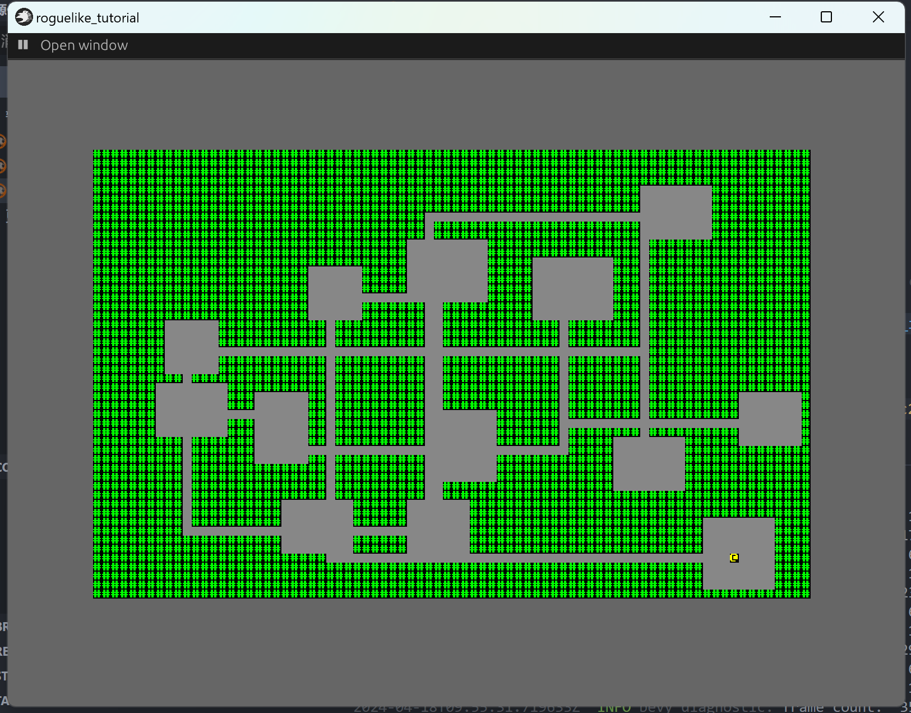

+++
title = "roguelike_chapter3 更有意思的地图"
date = 2024-01-24

[taxonomies]
tags = ["roguelike", "bevy"]
+++

[bracketproductions](https://bfnightly.bracketproductions.com)的 bevy 实现。
代码仓库: [RoguelikeTutorial](https://github.com/zuiyu1998/RoguelikeTutorial.git)

<!-- more -->

# 添加多个房间

上期使用 new_map 创建了一个简易地图，现在为地图添加房间。
在 src/map.rs 中添加 Rect，同时添加必要的函数，代码如下:

```rust
pub struct Rect {
    pub x1: i32,
    pub x2: i32,
    pub y1: i32,
    pub y2: i32,
}

impl Rect {
    pub fn new(x: i32, y: i32, w: i32, h: i32) -> Rect {
        Rect {
            x1: x,
            y1: y,
            x2: x + w,
            y2: y + h,
        }
    }

    // Returns true if this overlaps with other
    pub fn intersect(&self, other: &Rect) -> bool {
        self.x1 <= other.x2 && self.x2 >= other.x1 && self.y1 <= other.y2 && self.y2 >= other.y1
    }

    pub fn center(&self) -> (i32, i32) {
        ((self.x1 + self.x2) / 2, (self.y1 + self.y2) / 2)
    }
}
```

intersect 函数用来判断重合，center 返回 rect 的中心位置。

为 map 添加 apply_room_to_map 函数，将 rect 的数据映射到 map 上。代码如下:

```rust
    fn apply_room_to_map(&mut self, room: &Rect) {
        for y in room.y1 + 1..=room.y2 {
            for x in room.x1 + 1..=room.x2 {
                let index = self.xy_idx(x, y);
                self.tiles[index] = TileType::Floor;
            }
        }
    }
```

更改 new_map 的实现，添加两个 rect，代码如下：

```rust
pub fn new_map() -> Map {
    let mut map = Map::default();

    let room1 = Rect::new(20, 15, 10, 15);
    let room2 = Rect::new(35, 15, 10, 15);

    map.apply_room_to_map(&room1);
    map.apply_room_to_map(&room2);

    map
}
```

# 为房间添加过道

为 map 添加 2 个函数，一个函数为房间添加横向的过道，一个是为房间添加纵向的过道。代码如下:

```rust
    fn apply_horizontal_tunnel(&mut self, x1: i32, x2: i32, y: i32) {
        for x in x1.min(x2)..=x1.max(x2) {
            let index = self.xy_idx(x, y);

            if index > 0 && index < (self.width * self.height) as usize {
                self.tiles[index] = TileType::Floor;
            }
        }
    }

    fn apply_vertical_tunnel(&mut self, y1: i32, y2: i32, x: i32) {
        for y in y1.min(y2)..=y1.max(y2) {
            let idx = self.xy_idx(x, y);
            if idx > 0 && idx < (self.width * self.height) as usize {
                self.tiles[idx] = TileType::Floor;
            }
        }
    }
```

# 制作一个地牢

现在可以用现有的函数制作一个地牢了。修改 new_map 函数，代码如下:

```rust
pub fn new_map() -> Map {
    let mut map = Map::default();

    let mut rooms: Vec<Rect> = Vec::new();
    const MAX_ROOMS: i32 = 30;
    const MIN_SIZE: i32 = 6;
    const MAX_SIZE: i32 = 10;

    let mut rng = RandomNumberGenerator::new();

    for _ in 0..MAX_ROOMS {
        let w = rng.range(MIN_SIZE, MAX_SIZE);
        let h = rng.range(MIN_SIZE, MAX_SIZE);
        let x = rng.roll_dice(1, map.width - w - 1) - 1;
        let y = rng.roll_dice(1, map.height - h - 1) - 1;
        let new_room = Rect::new(x, y, w, h);
        let mut ok = true;
        for other_room in rooms.iter() {
            if new_room.intersect(other_room) {
                ok = false
            }
        }
        if ok {
            map.apply_room_to_map(&new_room);
            rooms.push(new_room);
        }
    }

    map
}
```

这里使用随机数生成器生成了多个房间。要注意的是这里需要修改 map 的 default 函数，将 tiles 默认改成 Wall，才可以看到正常的地图。
在房间生成后，为每个房间添加过道，代码如下：

```rust
 if ok {
            map.apply_room_to_map(&new_room);

            if !rooms.is_empty() {
                let (new_x, new_y) = new_room.center();
                let (prev_x, prev_y) = rooms[rooms.len() - 1].center();
                if rng.range(0, 2) == 1 {
                    map.apply_horizontal_tunnel(prev_x, new_x, prev_y);
                    map.apply_vertical_tunnel(prev_y, new_y, new_x);
                } else {
                    map.apply_vertical_tunnel(prev_y, new_y, prev_x);
                    map.apply_horizontal_tunnel(prev_x, new_x, new_y);
                }
            }

            rooms.push(new_room);
        }
```

运行代码，右键左上角的按钮，点击 playing，右键左上角的按钮，会出现下图界面。



# 设置玩家的初始位置

将 new_map 改为 new_map_rooms_and_corridors,并返回房间列表。获取房间列表第一个房间的中心作为玩家的位置，代码如下:

```rust
pub fn new_map_rooms_and_corridors() -> (Map, Vec<Rect>) {
    let mut map = Map::default();

    let mut rooms: Vec<Rect> = Vec::new();
    const MAX_ROOMS: i32 = 30;
    const MIN_SIZE: i32 = 6;
    const MAX_SIZE: i32 = 10;

    let mut rng = RandomNumberGenerator::new();

    for _ in 0..MAX_ROOMS {
        let w = rng.range(MIN_SIZE, MAX_SIZE);
        let h = rng.range(MIN_SIZE, MAX_SIZE);
        let x = rng.roll_dice(1, map.width - w - 1) - 1;
        let y = rng.roll_dice(1, map.height - h - 1) - 1;
        let new_room = Rect::new(x, y, w, h);
        let mut ok = true;
        for other_room in rooms.iter() {
            if new_room.intersect(other_room) {
                ok = false
            }
        }
        if ok {
            map.apply_room_to_map(&new_room);

            if !rooms.is_empty() {
                let (new_x, new_y) = new_room.center();
                let (prev_x, prev_y) = rooms[rooms.len() - 1].center();
                if rng.range(0, 2) == 1 {
                    map.apply_horizontal_tunnel(prev_x, new_x, prev_y);
                    map.apply_vertical_tunnel(prev_y, new_y, new_x);
                } else {
                    map.apply_vertical_tunnel(prev_y, new_y, prev_x);
                    map.apply_horizontal_tunnel(prev_x, new_x, new_y);
                }
            }

            rooms.push(new_room);
        }
    }

    (map, rooms)
}

```

在 setup_game 系统将第一个房间的中心位置赋给玩家。代码如下:

```rust
fn setup_game(
    mut commands: Commands,
    texture_assets: Res<TextureAssets>,
    mut layout_assets: ResMut<Assets<TextureAtlasLayout>>,
    theme: Res<Theme>,
) {
    let (map, rooms) = new_map_rooms_and_corridors();

    map.spawn_tiles(&mut commands, &texture_assets, &mut layout_assets, &theme);

    commands.insert_resource(map);

    let sprite_bundle = create_sprite_sheet_bundle(
        &texture_assets,
        &mut layout_assets,
        theme.player_to_render(),
    );
    let first = rooms[0].center();

    commands.spawn((
        sprite_bundle,
        Position {
            x: first.0,
            y: first.1,
        },
        Player,
    ));
}
```

# 限制玩家走向

在 src/player.rs 中修改 player_input 系统，限制玩家走向 WAll 地形，代码如下:

```rust
pub fn player_input(
    keyboard_input: Res<ButtonInput<KeyCode>>,
    mut q_player: Query<&mut Position, With<Player>>,
    map: Res<Map>,
) {
    let mut pos = match q_player.get_single_mut() {
        Ok(pos) => pos,
        Err(_) => return,
    };

    let input = get_input(&keyboard_input);

    let new_pos_x = pos.x + input.x as i32;
    let new_pos_y = pos.y + input.y as i32;

    let index = map.xy_idx(new_pos_x, new_pos_y);

    if map.tiles[index] == TileType::Wall {
        return;
    }

    pos.x = new_pos_x;
    pos.y = new_pos_y;
}

```

同时调整 player_input 的调度，在 PreUpdate 执行，改为 Update 执行。代码如下:

```rust
impl Plugin for PlayerPlugin {
    fn build(&self, app: &mut App) {
        app.add_systems(Update, (player_input,).run_if(in_state(GameState::Playing)));
    }
}
```

运行代码，右键左上角的按钮，点击 playing，右键左上角的按钮，会出现下图界面。


# 致谢

- [bevy](https://github.com/bevyengine/bevy),游戏引擎
- [bevy_game_template](https://github.com/NiklasEi/bevy_game_template.git),游戏模板
- [bevy_ascii_terminal](https://github.com/sarkahn/bevy_ascii_terminal),字符显示
- [bevy_editor_pls](https://github.com/jakobhellermann/bevy_editor_pls),可视化编辑器
- [bracket-random](https://github.com/amethyst/bracket-lib)，随机数生成器
