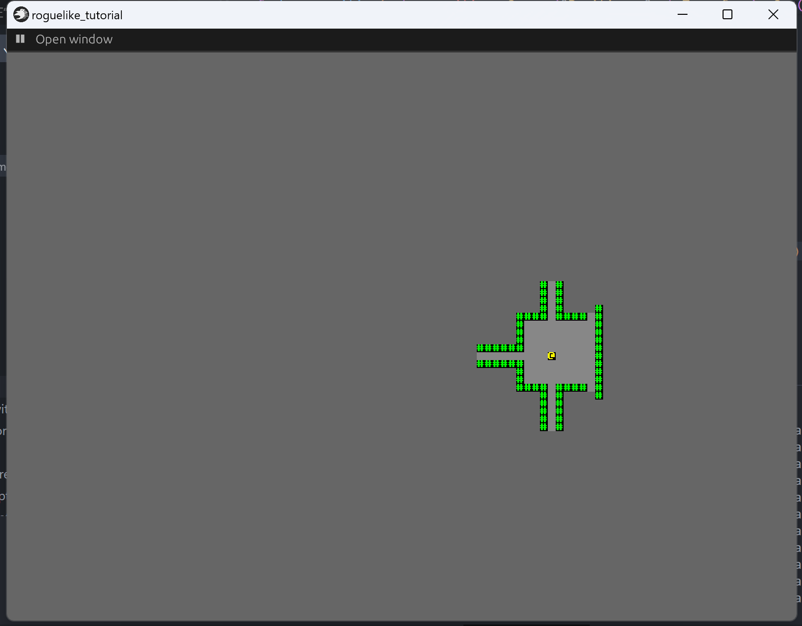
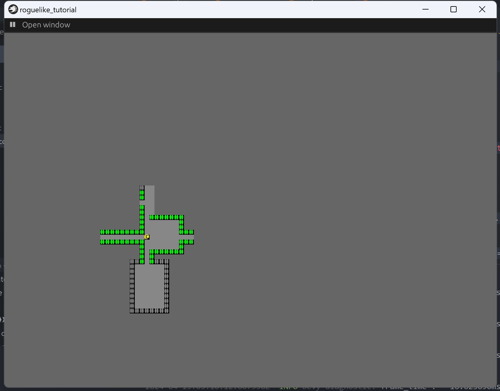

+++
title = "roguelike_chapter4 添加视野"
date = 2024-01-24

[taxonomies]
tags = ["roguelike", "bevy"]
+++

[bracketproductions](https://bfnightly.bracketproductions.com)的 bevy 实现。
代码仓库: [RoguelikeTutorial](https://github.com/zuiyu1998/RoguelikeTutorial.git)

<!-- more -->

# 添加视野

玩家只能看到一部分内容，而不是所有。为此添加一个 Viewshed 组件来跟踪玩家对的可见内容。在 src/common.rs 中添加如下代码：

```rust
#[derive(Component)]
pub struct Viewshed {
    pub visible_tiles: Vec<Point>,
    pub range: i32,
}
```

range 表示当前人物的视野范围，visible_tiles 表示可见的 tiles。
为玩家实体添加 Viewshed 组件，修改 src/logic.rs 的 setup_game 系统，代码如下:

```rust
    commands.entity(map_entity).with_children(|builder| {
        builder.spawn((
            sprite_bundle,
            Position {
                x: first.0,
                y: first.1,
            },
            Player,
            Viewshed {
                range: 9,
                visible_tiles: vec![],
            },
        ));
    });
```

接下来为 Map 实现一些 trait，以便可以寻路和视野常见的功能。
在 src/map.rs 中，为 map 实现 Algorithm2D 和 BaseMap，代码如下:

```rust
impl Algorithm2D for Map {
    fn dimensions(&self) -> Point {
        Point::new(self.width, self.height)
    }
}

impl BaseMap for Map {
    fn is_opaque(&self, idx: usize) -> bool {
        self.tiles[idx as usize] == TileType::Wall
    }
}

```

在 src/common.rs 中新增一个系统 update_viewshed 更改人物的视野。代码如下:

```rust
fn update_viewshed(mut q_viewshed: Query<(&Position, &mut Viewshed)>, map: Res<Map>) {
    for (pos, mut viewshed) in q_viewshed.iter_mut() {
        viewshed.visible_tiles.clear();
        viewshed.visible_tiles = field_of_view(Point::new(pos.x, pos.y), viewshed.range, &*map);
        viewshed
            .visible_tiles
            .retain(|p| p.x >= 0 && p.x < map.width && p.y >= 0 && p.y < map.height);
    }
}
```

新增一个系统 update_visibility 用来更改 tile 的显示。

```rust
fn update_visibility(
    q_player: Query<&Viewshed, With<Player>>,
    mut q_tiles: Query<(&mut Visibility, &Position), With<MapTile>>,
) {
    for viewshed in q_player.iter() {
        for (mut visibility, pos) in q_tiles.iter_mut() {
            if viewshed.visible_tiles.contains(&Point::new(pos.x, pos.y)) {
                *visibility = Visibility::Visible;
            } else {
                *visibility = Visibility::Hidden;
            }
        }
    }
}
```

在 src/consts.rs 中新增 PLAYER_Z_INDEX 为 10.0，表示玩家的层级，在 src/logic.rs 中 setup_game 系统设置玩家层级。代码如下:

```rust

    let mut sprite_bundle = create_sprite_sheet_bundle(
        &texture_assets,
        &mut layout_assets,
        theme.player_to_render(),
    );

    sprite_bundle.transform.translation.z = PLAYER_Z_INDEX;

```

最后记得把 update_viewshed，update_visibility 系统放入 CommonPlugin，并调整调度，代码如下:

```rust
impl Plugin for CommonPlugin {
    fn build(&self, app: &mut App) {
        app.register_type::<Position>();

        app.add_systems(
            Update,
            (keep_position, update_viewshed, update_visibility)
                .run_if(in_state(GameState::Playing)),
        );
    }
}

```

运行代码，右键左上角的按钮，点击 playing，右键左上角的按钮，会出现下图界面。



# 存储玩家已浏览的区域

在 map 中新增字段 revealed_tiles，这个字段将会保存玩家已浏览的数据，默认为 false，未浏览。代码如下:

```rust
#[derive(Resource, Debug)]
pub struct Map {
    pub width: i32,
    pub height: i32,
    pub tiles: Vec<TileType>,
    pub revealed_tiles: Vec<bool>,
}
```

记得在 default 函数中将 revealed_tiles 设置为 false。在 src/player.rs 中新增一个资源保存当前玩家的实体，以便在其他地方使用，代码如下:

```rust
#[derive(Resource)]
pub struct PlayerEntity(pub Entity);

```

在 setup_game 系统中插入该资源。代码如下:

```rust
let player = commands
        .spawn((
            sprite_bundle,
            Position {
                x: first.0,
                y: first.1,
            },
            Player,
            Viewshed {
                range: 9,
                visible_tiles: vec![],
            },
            Name::new("Player"),
        ))
        .id();

    commands.entity(player).set_parent(map_entity);

    commands.insert_resource(PlayerEntity(player));
```

更改 update_viewshed 系统，在此系统中记录已浏览的数据，代码如下:

```rust
fn update_viewshed(
    mut q_viewshed: Query<(&Position, &mut Viewshed, Entity)>,
    mut map: ResMut<Map>,
    player_entity: Res<PlayerEntity>,
) {
    for (pos, mut viewshed, entity) in q_viewshed.iter_mut() {
        viewshed.visible_tiles.clear();
        viewshed.visible_tiles = field_of_view(Point::new(pos.x, pos.y), viewshed.range, &*map);
        viewshed
            .visible_tiles
            .retain(|p| p.x >= 0 && p.x < map.width && p.y >= 0 && p.y < map.height);

        if entity == player_entity.0 {
            for point in viewshed.visible_tiles.iter() {
                let idx = map.xy_idx(point.x, point.y);

                map.revealed_tiles[idx] = true;
            }
        }
    }
}
```

更改 MapTheme trait，添加一个 revealed_tile_to_render 方法，代码如下:

```rust
pub trait MapTheme: 'static + Sync + Send {
    fn tile_to_render(&self, tile_type: TileType) -> Glyph;

    fn revealed_tile_to_render(&self, tile_type: TileType) -> Glyph;

    fn player_to_render(&self) -> Glyph;
}

pub struct DefaultTheme;

impl MapTheme for DefaultTheme {
    fn tile_to_render(&self, tile_type: TileType) -> Glyph {
        match tile_type {
            TileType::Floor => Glyph {
                color: Color::rgba(0.529, 0.529, 0.529, 1.0),
                index: 219,
            },
            TileType::Wall => Glyph {
                color: Color::rgba(0.0, 1.0, 0.0, 1.0),
                index: '#' as usize,
            },
        }
    }

    fn revealed_tile_to_render(&self, tile_type: TileType) -> Glyph {
        match tile_type {
            TileType::Floor => Glyph {
                color: Color::rgba(0.529, 0.529, 0.529, 1.0),
                index: 219,
            },
            TileType::Wall => Glyph {
                color: Color::rgba(0.529, 0.529, 0.529, 1.0),
                index: '#' as usize,
            },
        }
    }

    fn player_to_render(&self) -> Glyph {
        Glyph {
            color: Color::YELLOW,
            index: 64,
        }
    }
}
```

修改 update_visibility 系统，在直接可见和已浏览的地图赋予不同的色彩，代码如下:

```rust
fn update_visibility(
    q_player: Query<&Viewshed, With<Player>>,
    mut q_tiles: Query<(&mut Visibility, &Position, &mut Sprite), With<MapTile>>,
    map: Res<Map>,
    theme: Res<Theme>,
) {
    for viewshed in q_player.iter() {
        for (mut visibility, pos, mut sprite) in q_tiles.iter_mut() {
            if viewshed.visible_tiles.contains(&Point::new(pos.x, pos.y)) {
                *visibility = Visibility::Visible;

                let idx = map.xy_idx(pos.x, pos.y);

                let tile = map.tiles[idx];

                let glyph = theme.tile_to_render(tile);
                sprite.color = glyph.color;
            } else {
                let idx = map.xy_idx(pos.x, pos.y);

                if map.revealed_tiles[idx] {
                    *visibility = Visibility::Visible;

                    let tile = map.tiles[idx];

                    let glyph = theme.revealed_tile_to_render(tile);
                    sprite.color = glyph.color;
                } else {
                    *visibility = Visibility::Hidden;
                }
            }
        }
    }
}

```

# 减少不必要的计算

在 Viewshed 中新增一个字段，dirty ，只有当 dirty 为真是，才重新计算可见 tile，代码如下:

```rust
#[derive(Component)]
pub struct Viewshed {
    pub visible_tiles: Vec<Point>,
    pub range: i32,
    pub dirty: bool,
}
```

修改 update_viewshed 系统，在 dirty 为假时直接返回，代码如下:

```rust
fn update_viewshed(
    mut q_viewshed: Query<(&Position, &mut Viewshed, Entity)>,
    mut map: ResMut<Map>,
    player_entity: Res<PlayerEntity>,
) {
    for (pos, mut viewshed, entity) in q_viewshed.iter_mut() {
        if !viewshed.dirty {
            continue;
        }

        viewshed.visible_tiles.clear();
        viewshed.visible_tiles = field_of_view(Point::new(pos.x, pos.y), viewshed.range, &*map);
        viewshed
            .visible_tiles
            .retain(|p| p.x >= 0 && p.x < map.width && p.y >= 0 && p.y < map.height);

        if entity == player_entity.0 {
            for point in viewshed.visible_tiles.iter() {
                let idx = map.xy_idx(point.x, point.y);

                map.revealed_tiles[idx] = true;
            }
        }
    }
}
```

运行代码，右键左上角的按钮，点击 playing，右键左上角的按钮，会出现下图界面。



# 致谢

- [bevy](https://github.com/bevyengine/bevy),游戏引擎
- [bevy_game_template](https://github.com/NiklasEi/bevy_game_template.git),游戏模板
- [bevy_editor_pls](https://github.com/jakobhellermann/bevy_editor_pls),可视化编辑器
- [bracket-random](https://github.com/amethyst/bracket-lib)，随机数生成器
- [bracket-pathfinding](https://github.com/amethyst/bracket-lib) 寻路
