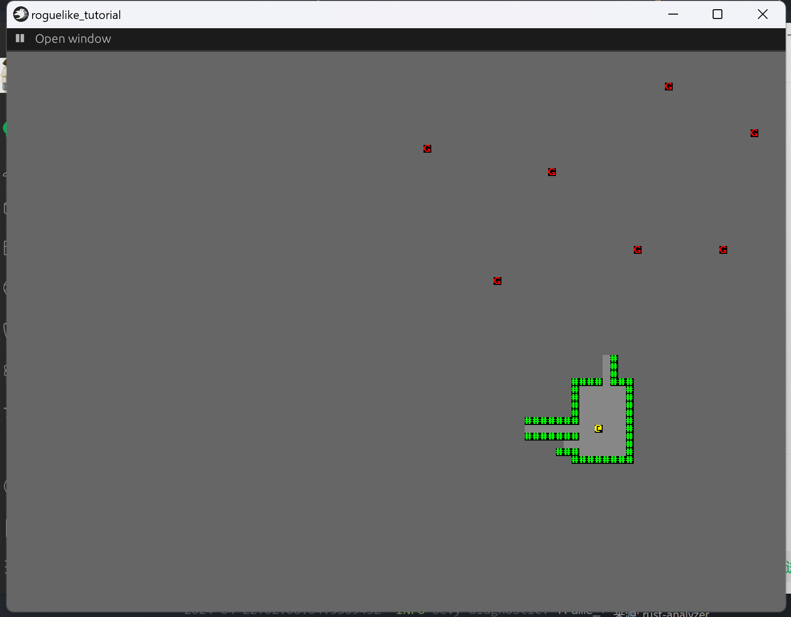
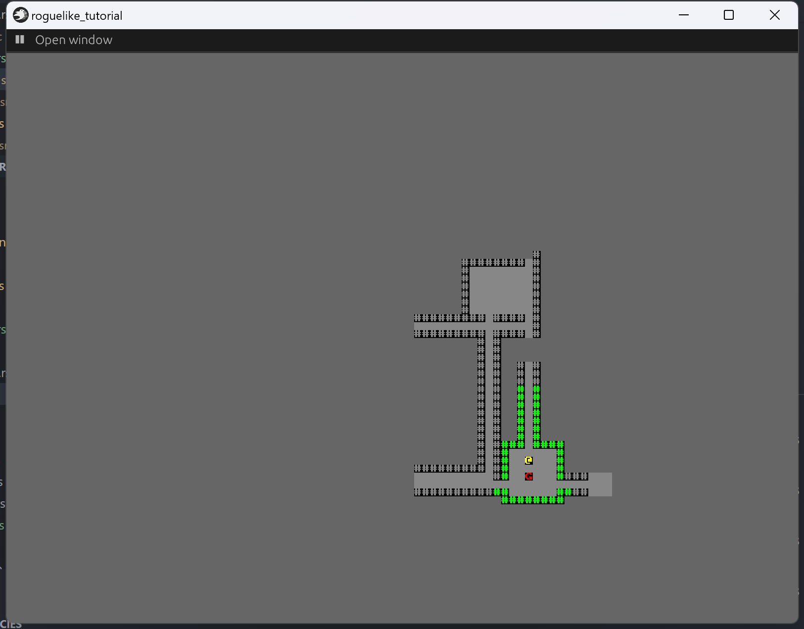

+++
title = "roguelike_chapter5 添加敌人"
date = 2024-01-24

[taxonomies]
tags = ["roguelike", "bevy"]
+++

[bracketproductions](https://bfnightly.bracketproductions.com)的 bevy 实现。
代码仓库: [RoguelikeTutorial](https://github.com/zuiyu1998/RoguelikeTutorial.git)

<!-- more -->

# 在每个房间内添加一个敌人

新增 src/theme.rs，同时将 map 中的代码关于 Theme 的迁移。代码如下:

```rust
pub struct ThemePlugin;

impl Plugin for ThemePlugin {
    fn build(&self, app: &mut App) {
        app.init_resource::<Theme>();
    }
}

pub trait MapTheme: 'static + Sync + Send {
    fn tile_to_render(&self, tile_type: TileType) -> Glyph;

    fn revealed_tile_to_render(&self, tile_type: TileType) -> Glyph;

    fn player_to_render(&self) -> Glyph;
}

#[derive(Resource, Deref)]
pub struct Theme(Box<dyn MapTheme>);

impl Default for Theme {
    fn default() -> Self {
        Theme(Box::new(DefaultTheme))
    }
}

pub struct DefaultTheme;

impl MapTheme for DefaultTheme {
    fn tile_to_render(&self, tile_type: TileType) -> Glyph {
        match tile_type {
            TileType::Floor => Glyph {
                color: Color::rgba(0.529, 0.529, 0.529, 1.0),
                index: 219,
            },
            TileType::Wall => Glyph {
                color: Color::rgba(0.0, 1.0, 0.0, 1.0),
                index: '#' as usize,
            },
        }
    }

    fn revealed_tile_to_render(&self, tile_type: TileType) -> Glyph {
        match tile_type {
            TileType::Floor => Glyph {
                color: Color::rgba(0.529, 0.529, 0.529, 1.0),
                index: 219,
            },
            TileType::Wall => Glyph {
                color: Color::rgba(0.529, 0.529, 0.529, 1.0),
                index: '#' as usize,
            },
        }
    }

    fn player_to_render(&self) -> Glyph {
        Glyph {
            color: Color::YELLOW,
            index: 64,
        }
    }
}
```

注意将 ThemePlugin 放入 src/lib.rs 的 GamePlugin 中。
在 src/enemy.rs 中新增一个 EnemyTile 和 EnemyPlugin。代码如下:

```rust
pub struct EnemyPlugin;

impl Plugin for EnemyPlugin {
    fn build(&self, app: &mut App) {}
}

pub enum EnemyType {
    G,
}


```

为 src/theme.rs 中的 MapTheme 添加一个新的函数，代码如下：

```rust
pub trait MapTheme: 'static + Sync + Send {
    fn tile_to_render(&self, tile_type: TileType) -> Glyph;

    fn revealed_tile_to_render(&self, tile_type: TileType) -> Glyph;

    fn player_to_render(&self) -> Glyph;

    fn enemy_to_render(&self, enemy_type: EnemyType) -> Glyph;
}
```

为 DefaultTheme 添加新的实现，代码如下:

```rust
fn enemy_to_render(&self, enemy_type: EnemyType) -> Glyph {
        match enemy_type {
            EnemyType::G => Glyph {
                color: Color::RED,
                index: 'G' as usize,
            },
        }
    }
```

最后在 src/logic.rs 的 setup_game 系统添加生成敌人的逻辑。在这一步之前，首先对 map 进行一定的改造，将 room 保存在 map 中。代码如下:

```rust
#[derive(Resource, Debug)]
pub struct Map {
    pub width: i32,
    pub height: i32,
    pub tiles: Vec<TileType>,
    pub revealed_tiles: Vec<bool>,
    pub rooms: Vec<Rect>,
}

```

将 src.map.rs 中 new_map_rooms_and_corridors 函数改为如下所示:

```rust
pub fn new_map_rooms_and_corridors() -> Map {
    let mut map = Map::default();

    let mut rooms: Vec<Rect> = Vec::new();
    const MAX_ROOMS: i32 = 30;
    const MIN_SIZE: i32 = 6;
    const MAX_SIZE: i32 = 10;

    let mut rng = RandomNumberGenerator::new();

    for _ in 0..MAX_ROOMS {
        let w = rng.range(MIN_SIZE, MAX_SIZE);
        let h = rng.range(MIN_SIZE, MAX_SIZE);
        let x = rng.roll_dice(1, map.width - w - 1) - 1;
        let y = rng.roll_dice(1, map.height - h - 1) - 1;
        let new_room = Rect::new(x, y, w, h);
        let mut ok = true;
        for other_room in rooms.iter() {
            if new_room.intersect(other_room) {
                ok = false
            }
        }
        if ok {
            map.apply_room_to_map(&new_room);

            if !rooms.is_empty() {
                let (new_x, new_y) = new_room.center();
                let (prev_x, prev_y) = rooms[rooms.len() - 1].center();
                if rng.range(0, 2) == 1 {
                    map.apply_horizontal_tunnel(prev_x, new_x, prev_y);
                    map.apply_vertical_tunnel(prev_y, new_y, new_x);
                } else {
                    map.apply_vertical_tunnel(prev_y, new_y, prev_x);
                    map.apply_horizontal_tunnel(prev_x, new_x, new_y);
                }
            }

            rooms.push(new_room);
        }
    }

    map.rooms = rooms;

    map
}
```

最后为 settup_game 系统添加生成怪物的逻辑,除了第一个房间，其他每个房间都在中心位置生成一个敌人。代码如下:

```rust
fn setup_game(
    mut commands: Commands,
    texture_assets: Res<TextureAssets>,
    mut layout_assets: ResMut<Assets<TextureAtlasLayout>>,
    theme: Res<Theme>,
) {
    let map = new_map_rooms_and_corridors();

    let map_entity = map.spawn_tiles(&mut commands, &texture_assets, &mut layout_assets, &theme);

    let mut sprite_bundle = create_sprite_sheet_bundle(
        &texture_assets,
        &mut layout_assets,
        theme.player_to_render(),
    );

    sprite_bundle.transform.translation.z = PLAYER_Z_INDEX;

    let first = map.rooms[0].center();

    let player = commands
        .spawn((
            sprite_bundle,
            Position {
                x: first.0,
                y: first.1,
            },
            Player,
            Viewshed {
                range: 9,
                visible_tiles: vec![],
                dirty: true,
            },
            Name::new("Player"),
        ))
        .id();

    commands.entity(player).set_parent(map_entity);

    commands.insert_resource(PlayerEntity(player));

    for room in map.rooms.iter().skip(1) {
        let enemy_tile = EnemyType::G;

        let enemy_pos = room.center();

        let sprite_bundle = create_sprite_sheet_bundle(
            &texture_assets,
            &mut layout_assets,
            theme.enemy_to_render(enemy_tile),
        );

        commands.spawn((
            sprite_bundle,
            Position {
                x: enemy_pos.0,
                y: enemy_pos.1,
            },
        ));
    }

    commands.insert_resource(map);
}
```

运行代码，右键左上角的按钮，点击 playing，右键左上角的按钮，会出现下图界面。


所有的敌人都可以看到，接下来修复这个问题。

# 玩家只能看见能看见的东西

在 map 中新增一个字段 visible_tiles 用来保存所有可见的位置，代码如下:

```rust
pub struct Map {
    pub width: i32,
    pub height: i32,
    pub tiles: Vec<TileType>,
    pub revealed_tiles: Vec<bool>,
    pub rooms: Vec<Rect>,
    pub visible_tiles: Vec<bool>,
}
```

在 src/common/mod.rs 中修改 update_viewshed 系统，代码如下:

```rust
fn update_viewshed(
    mut q_viewshed: Query<(&Position, &mut Viewshed, Entity)>,
    mut map: ResMut<Map>,
    player_entity: Res<PlayerEntity>,
) {
    for (pos, mut viewshed, entity) in q_viewshed.iter_mut() {
        if !viewshed.dirty {
            continue;
        }

        viewshed.visible_tiles.clear();
        viewshed.visible_tiles = field_of_view(Point::new(pos.x, pos.y), viewshed.range, &*map);
        viewshed
            .visible_tiles
            .retain(|p| p.x >= 0 && p.x < map.width && p.y >= 0 && p.y < map.height);

        if entity == player_entity.0 {
            for t in map.visible_tiles.iter_mut() {
                *t = false
            }

            for point in viewshed.visible_tiles.iter() {
                let idx = map.xy_idx(point.x, point.y);

                map.revealed_tiles[idx] = true;
                map.visible_tiles[idx] = true;
            }
        }
    }
}
```

在 update_viewshed 中更新了每个可见的位置，
现在 src/enemy.rs 中添加一个 Enemy 组件，用来标识敌人。代码如下:

```rust
#[derive(Debug, Component)]
pub struct Enemy;

```

更改 src/logic.rs 下的 setup_game 系统，为每个敌人添加 Enemy 组件。代码如下:

```rust
for room in map.rooms.iter().skip(1) {
        let enemy_tile = EnemyType::G;

        let enemy_pos = room.center();

        let sprite_bundle = create_sprite_sheet_bundle(
            &texture_assets,
            &mut layout_assets,
            theme.enemy_to_render(enemy_tile),
        );

        let enemy = commands
            .spawn((
                sprite_bundle,
                Position {
                    x: enemy_pos.0,
                    y: enemy_pos.1,
                },
                Enemy,
            ))
            .id();

        commands.entity(enemy).set_parent(map_entity);
    }
```

set_parent 是为了让敌人和玩家都位于 Map 的实体下。

最后更改 update_visibility 系统，只有可见的位置才会显示处理。代码如下:

```rust
fn update_visibility(
    mut q_position: Query<(&mut Visibility, &Position, &mut Sprite, Entity)>,
    q_tiles: Query<&MapTile>,
    map: Res<Map>,
    theme: Res<Theme>,
) {
    for (mut visibility, pos, mut sprite, entity) in q_position.iter_mut() {
        let idx = map.xy_idx(pos.x, pos.y);

        if map.visible_tiles[idx] {
            *visibility = Visibility::Visible;

            if q_tiles.get(entity).is_ok() {
                let tile = map.tiles[idx];
                let glyph = theme.tile_to_render(tile);
                sprite.color = glyph.color;
            }
        } else {
            if q_tiles.get(entity).is_ok() && map.revealed_tiles[idx] {
                *visibility = Visibility::Visible;

                let tile = map.tiles[idx];

                let glyph = theme.revealed_tile_to_render(tile);
                sprite.color = glyph.color;
            } else {
                *visibility = Visibility::Hidden;
            }
        }
    }
}
```

最后，设置敌人的层次，在 src/consts.rs 中新增 ENEMY_Z_INDEX 为 9.0。在 setup_game 系统生成敌人实体是设置层次。代码如下:

```rust
for room in map.rooms.iter().skip(1) {
        let enemy_tile = EnemyType::G;

        let enemy_pos = room.center();

        let mut sprite_bundle = create_sprite_sheet_bundle(
            &texture_assets,
            &mut layout_assets,
            theme.enemy_to_render(enemy_tile),
        );

        sprite_bundle.transform.translation.z = ENEMY_Z_INDEX;

        let enemy = commands
            .spawn((
                sprite_bundle,
                Position {
                    x: enemy_pos.0,
                    y: enemy_pos.1,
                },
                Enemy,
            ))
            .id();

        commands.entity(enemy).set_parent(map_entity);
    }
```

运行代码，右键左上角的按钮，点击 playing，右键左上角的按钮，会出现下图界面。



# 致谢

- [bevy](https://github.com/bevyengine/bevy),游戏引擎
- [bevy_game_template](https://github.com/NiklasEi/bevy_game_template.git),游戏模板
- [bevy_ascii_terminal](https://github.com/sarkahn/bevy_ascii_terminal),字符显示
- [bevy_editor_pls](https://github.com/jakobhellermann/bevy_editor_pls),可视化编辑器
- [bracket-random](https://github.com/amethyst/bracket-lib)，随机数生成器
- [bracket-pathfinding](https://github.com/amethyst/bracket-lib) 寻路

```

```
