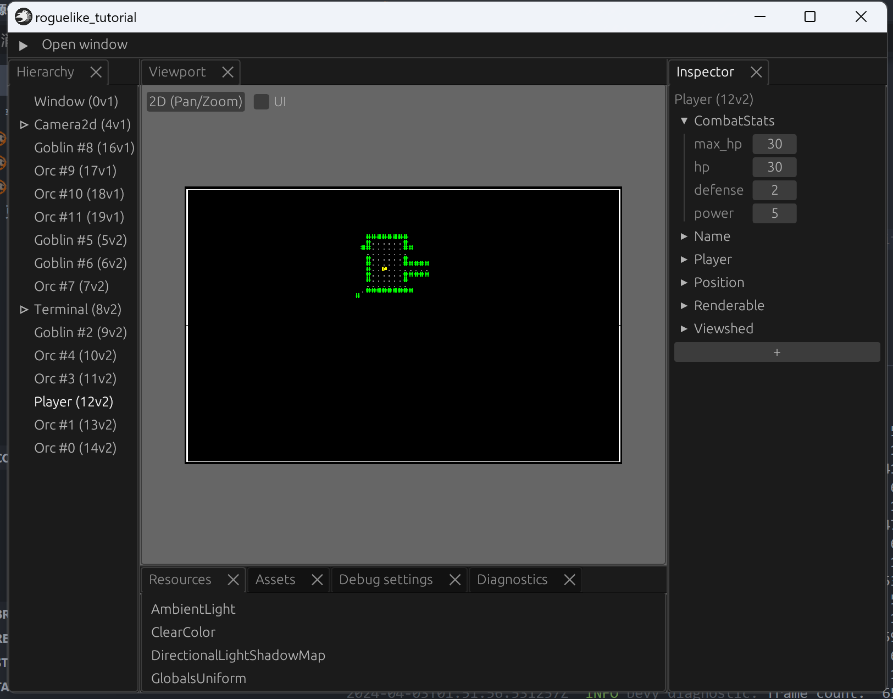

+++
title = "roguelike_chapter6 造成伤害"
date = 2024-03-30

[taxonomies]
tags = ["roguelike", "bevy"]
+++

[bracketproductions](https://bfnightly.bracketproductions.com)的 bevy 实现。
代码仓库: [RoguelikeTutorial](https://github.com/zuiyu1998/RoguelikeTutorial.git)

<!-- more -->

# 追赶玩家

在 src/map.rs 中我们为 Map 实现了 BaseMap。现在为 Map 实现更多的方法来帮助敌人寻找路线。代码如下:

```rust
  fn is_exit_valid(&self, x: i32, y: i32) -> bool {
        if x < 1 || x > self.width as i32 - 1 || y < 1 || y > self.height as i32 - 1 {
            return false;
        }
        let idx = self.xy_idx(x, y);
        self.tiles[idx as usize] != TileType::Wall
    }
```

为 Map 的 BaseMap 的 trait 添加 get_available_exits 的自定义实现，代码如下:

```rust
    fn get_available_exits(&self, idx: usize) -> SmallVec<[(usize, f32); 10]> {
        let mut exits = SmallVec::new();
        let x = idx as i32 % (self.width as i32);
        let y = idx as i32 / (self.width as i32);
        let w = self.width as usize;

        // Cardinal directions
        if self.is_exit_valid(x - 1, y) {
            exits.push((idx - 1, 1.0))
        };
        if self.is_exit_valid(x + 1, y) {
            exits.push((idx + 1, 1.0))
        };
        if self.is_exit_valid(x, y - 1) {
            exits.push((idx - w, 1.0))
        };
        if self.is_exit_valid(x, y + 1) {
            exits.push((idx + w, 1.0))
        };

        exits
    }

```

为 Map 的 BaseMap 的 trait 添加 get_pathing_distance 的自定义实现，代码如下:

```
fn get_pathing_distance(&self, idx1: usize, idx2: usize) -> f32 {
    let w = self.width as usize;
    let p1 = Point::new(idx1 % w, idx1 / w);
    let p2 = Point::new(idx2 % w, idx2 / w);
    DistanceAlg::Pythagoras.distance2d(p1, p2)
}
```

最后我们更改 monster_ai 系统，使用 a_star 算法，规划敌人和玩家的路径，并把最新的路径赋给敌人。代码如下:

```rust
pub fn monster_ai(
    mut set: ParamSet<(
        Query<(&mut Position, &mut Viewshed, &Monster, &Name)>,
        Query<&Position, With<Player>>,
    )>,

    mut map: ResMut<Map>,
) {
    let player = set.p1();
    let player_pos = player.single().clone();

    for (mut pos, mut viewshed, _, name) in set.p0().iter_mut() {
        //占位

        if viewshed
            .visible_tiles
            .contains(&Point::new(player_pos.x, player_pos.y))
        {
            info!("{} shouts insults", name);

            let path = a_star_search(
                map.xy_idx(pos.x, pos.y) as i32,
                map.xy_idx(player_pos.x, player_pos.y) as i32,
                &mut *map,
            );
            if path.success && path.steps.len() > 1 {
                pos.x = path.steps[1] as i32 % (map.width as i32);
                pos.y = path.steps[1] as i32 / (map.width as i32);
                viewshed.dirty = true;
            }
        }
    }
}
```

但是当我们运行程序，敌人会迅速靠近玩家，这是因为每一个帧,这个系统都会运行。当 fps 为 200 帧，它就会运行 200 次，通常情况下，这些会更改位置的系统倘若和时间无关，它应该以一个固定的频率运行。这是常说的逻辑帧。将这个系统放入 FixedUpdate stage，而不是 Update stage，它就会以默认 60 帧的频率运行。修改 src/logic.rs 中 LogicPlugin 中的代码。代码如下:

```rust
    app.add_systems(
            FixedUpdate,
            (monster_ai,).run_if(in_state(GameState::Playing)),
        );

```

再次运行代码，默认 60 帧的频率还是太快，调整为默认 2 帧,修改 LogicPlugin 的 plugin trait 实现，代码如下:

```rust
       let fix_time = Time::<Fixed>::from_hz(2.0);

        if let Some(mut _fix_time) = app.world.get_resource_mut::<Time<Fixed>>() {
            *_fix_time = fix_time;
        } else {
            app.insert_resource(fix_time);
        }
```

运行代码，右键左上角的按钮，点击 playing，右键左上角的按钮，会出现下图界面。


# 防止敌人互相踩踏

在 map 中添加字段记录不可行进地块的标识，Map 的定义如下:

```
#[derive(Resource)]
pub struct Map {
    pub width: usize,
    pub height: usize,
    pub tiles: Vec<TileType>,
    pub revealed_tiles: Vec<bool>,
    pub visible_tiles: Vec<bool>,
    pub blocked: Vec<bool>,
}
```

实现 default 的代码已省去，给 Map 新增一个函数，用于将地图数据的 blocked 信息记录到 blocked 中，这个函数要在 setup_game 中调用，代码如下:

```rust
    //将地图中block信息记录在blocked中
    pub fn populate_blocked(&mut self) {
        for (i, tile) in self.tiles.iter_mut().enumerate() {
            self.blocked[i] = *tile == TileType::Wall;
        }
    }
```

更改 Map 中的 is_exit_valid 函数，从判断 tile，改为缓存的 block 信息，代码如下:

```rust
    fn is_exit_valid(&self, x: i32, y: i32) -> bool {
        if x < 1 || x > self.width as i32 - 1 || y < 1 || y > self.height as i32 - 1 {
            return false;
        }
        let idx = self.xy_idx(x, y);
        !self.blocked[idx]
    }
```

在 Map 中新增一个 BlocksTile 组件，同时添加一个系统将 BlocksTile 组件的数据缓存。
在 src/map.rs 新增 BlocksTile 组件，代码如下:

```
#[derive(Component, Debug)]
pub struct BlocksTile {}
```

添加一个 update_bllocks 系统，代码如下:

```rust
pub fn update_blocks(q_blocks: Query<&Position, With<BlocksTile>>, mut map: ResMut<Map>) {
    map.populate_blocked();

    for pos in q_blocks.iter() {
        let idx = map.xy_idx(pos.x, pos.y);

        map.blocked[idx] = true;
    }
}
```

将 update_blocks 系统添加到 MapPlugin。为每个敌人实体添加 BlocksTile 组件。

# 防止敌人踩踏玩家

在 logic/map.rs 中修改 monster_ai 系统，在寻路之前，先进行距离判断，代码如下:

```rust
info!("{} shouts insults", name);

let distance = DistanceAlg::Pythagoras.distance2d(
    Point::new(pos.x, pos.y),
    Point::new(player_pos.x, player_pos.y),
);

if distance < 1.5 {
    return;
}
```

# 防止玩家踩踏敌人

修改 Positon 的 movement 函数，通过判断 block 信息决定是否前进。代码如下:

```rust
pub fn movement(&mut self, delta_x: i32, delta_y: i32, map: &Map, view: &mut Viewshed) {
    let next_x = 79.min(0.max(self.x + delta_x));
    let next_y = 79.min(0.max(self.y + delta_y));

    let idx = map.xy_idx(next_x, next_y);

    if !map.blocked[idx] {
        self.x = next_x;
        self.y = next_y;

        view.dirty = true;
    }
}
```

# 允许玩家对角线移动

修改 Map 的 get_available_exits 的函数，添加对角线的距离，代码如下:

```rust
fn get_available_exits(&self, idx: usize) -> SmallVec<[(usize, f32); 10]> {
    let mut exits = SmallVec::new();
    let x = idx as i32 % (self.width as i32);
    let y = idx as i32 / (self.width as i32);
    let w = self.width as usize;

    // Cardinal directions
    if self.is_exit_valid(x - 1, y) {
        exits.push((idx - 1, 1.0))
    };
    if self.is_exit_valid(x + 1, y) {
        exits.push((idx + 1, 1.0))
    };
    if self.is_exit_valid(x, y - 1) {
        exits.push((idx - w, 1.0))
    };
    if self.is_exit_valid(x, y + 1) {
        exits.push((idx + w, 1.0))
    };

    // Diagonals
    if self.is_exit_valid(x - 1, y - 1) {
        exits.push(((idx - w) - 1, 1.45));
    }
    if self.is_exit_valid(x + 1, y - 1) {
        exits.push(((idx - w) + 1, 1.45));
    }
    if self.is_exit_valid(x - 1, y + 1) {
        exits.push(((idx + w) - 1, 1.45));
    }
    if self.is_exit_valid(x + 1, y + 1) {
        exits.push(((idx + w) + 1, 1.45));
    }

    exits
}

```

# 添加 战斗状态

在 src/logic.rs 中添加一个 CombatStats 组件，它保存了玩家和敌人的一些有用的数据，比如血量。代码定义如下:

```rust
#[derive(Component, Debug)]
pub struct CombatStats {
    pub max_hp: i32,
    pub hp: i32,
    pub defense: i32,
    pub power: i32,
}
```

为玩家实体和敌人实体添加 CombatStats 组件。玩家 CombatStats 组件如下:

```rust
 CombatStats {
            max_hp: 30,
            hp: 30,
            defense: 2,
            power: 5,
        }
```

敌人 CombatStats 组件如下：

```rust
CombatStats {
                max_hp: 16,
                hp: 16,
                defense: 1,
                power: 3,
            },
```

# 为具有 position 组件的实体添加索引

在 map 中存储玩家和敌人的实体索引。在 map 中新增 tile_content 的字段。Map 当前的定义如下:

```rust
#[derive(Resource)]
pub struct Map {
    pub width: usize,
    pub height: usize,
    pub tiles: Vec<TileType>,
    pub revealed_tiles: Vec<bool>,
    pub visible_tiles: Vec<bool>,
    pub blocked: Vec<bool>,
    //新增
    pub tile_content: Vec<Vec<Entity>>,
}
```

为 map 新增一个函数，用来清空 tile_content 的数据。代码如下:

```
///清除tile_content
pub fn clear_content_index(&mut self) {
    for content in self.tile_content.iter_mut() {
        content.clear();
    }
}
```

更改 src/map 中的 update_blocks 系统，将 update_blocks 更改为 map_index。该系统用于缓存 blocks 数据和记录 postion 的实体索引。代码如下：

```rust
pub fn map_index(
    q_position: Query<(&Position, Entity)>,
    q_blocks: Query<Entity, With<BlocksTile>>,
    mut map: ResMut<Map>,
) {
    map.populate_blocked();
    map.clear_content_index();

    for (pos, entity) in q_position.iter() {
        let idx = map.xy_idx(pos.x, pos.y);

        if let Ok(_) = q_blocks.get(entity) {
            map.blocked[idx] = true;
        }

        map.tile_content[idx].push(entity);
    }
}
```

# 让玩家可以攻击

更改 src/logic.rs 中 user_input 系统，在玩家移动之前判断是否可以对敌人进行攻击。新增一个 handle_user_input 系统来处理 user_inut,代码如下。

```rust
fn handle_user_input(
    position: &mut Position,
    delta_x: i32,
    delta_y: i32,
    map: &Map,
    view: &mut Viewshed,
    q_combat_stats: &Query<&mut CombatStats>,
) {
    let next_x = ((map.width - 1) as i32).min(0.max(position.x + delta_x));
    let next_y = ((map.height - 1) as i32).min(0.max(position.y + delta_y));

    let idx = map.xy_idx(next_x, next_y);

    for potential_target in map.tile_content[idx].iter() {
        let target = q_combat_stats.get(*potential_target);
        match target {
            Err(_e) => {
                error!("tile content index error,entity is :{:?}", potential_target);
            }
            Ok(_t) => {
                // Attack it
                info!("From Hell's Heart, I stab thee!");
                return; // So we don't move after attacking
            }
        }
    }

    if !map.blocked[idx] {
        position.x = next_x;
        position.y = next_y;

        view.dirty = true;
    }
}
```

更改 user_input 系统中原来的 movement 系统，现在 user_input 系统如下:

```rust
pub fn user_input(
    keyboard_input: Res<ButtonInput<KeyCode>>,
    mut q_player: Query<(&mut Position, &mut Viewshed), With<Player>>,
    map: Res<Map>,
    q_combat_stats: Query<&mut CombatStats>,
) {
    let mut x = 0;
    let mut y = 0;

    if keyboard_input.just_pressed(KeyCode::KeyA) {
        x -= 1;
    }

    if keyboard_input.just_pressed(KeyCode::KeyD) {
        x += 1;
    }

    if keyboard_input.just_pressed(KeyCode::KeyW) {
        y += 1;
    }

    if keyboard_input.just_pressed(KeyCode::KeyS) {
        y -= 1;
    }

    for (mut position, mut viewshed) in q_player.iter_mut() {
        handle_user_input(&mut position, x, y, &map, &mut viewshed, &q_combat_stats);
    }
}
```

# 添加攻击

用一句话总结玩家攻击的行为。玩家对某个敌人发动了攻击，敌人收到玩家造成的伤害，敌人已经死亡。
实现一个系统实现玩家对某个敌人发动了攻击。
在 src/logic.rs 中添加一个组件用来标识被攻击者的组件，代码如下：

```rust
#[derive(Component, Debug, Clone)]
pub struct WantsToMelee {
    pub target: Entity,
}
```

在 src/logic.rs 的 user_input 系统中判断下一个移动的地图是否为可攻击的对象，如果有，添加一个 WantsToMelee 组件。代码如下:

```rust
fn handle_user_input(
    position: &mut Position,
    delta_x: i32,
    delta_y: i32,
    map: &Map,
    view: &mut Viewshed,
    q_combat_stats: &Query<&mut CombatStats>,
    commands: &mut EntityCommands,
) {
    let next_x = ((map.width - 1) as i32).min(0.max(position.x + delta_x));
    let next_y = ((map.height - 1) as i32).min(0.max(position.y + delta_y));

    let idx = map.xy_idx(next_x, next_y);

    for potential_target in map.tile_content[idx].iter() {
        let target = q_combat_stats.get(*potential_target);
        match target {
            Err(_e) => {
                error!("tile content index error,entity is :{:?}", potential_target);
            }
            Ok(_t) => {
                // Attack it
                info!("From Hell's Heart, I stab thee!");

                let entity = *potential_target;
                //生成子实体添加攻击组件
                commands.with_children(|parent| {
                    parent.spawn(WantsToMelee { target: entity });
                });

                return; // So we don't move after attacking
            }
        }
    }

    if !map.blocked[idx] {
        position.x = next_x;
        position.y = next_y;

        view.dirty = true;
    }
}


```

修复 map_index 系统添加了 player 的 bug。在 map_index 系统添加了 player 的索引，handle_user_input 此时会出现自己攻击自己的 bug。修复之后的代码如下:

```rust
pub fn map_index(
    q_position: Query<(&Position, Entity)>,
    q_blocks: Query<Entity, With<BlocksTile>>,
    mut map: ResMut<Map>,
) {
    map.populate_blocked();
    map.clear_content_index();

    for (pos, entity) in q_position.iter() {
        let idx = map.xy_idx(pos.x, pos.y);

        if let Ok(_) = q_blocks.get(entity) {
            map.blocked[idx] = true;
            map.tile_content[idx].push(entity);
        }
    }
}
```

添加一个系统计算收到的伤害。在 logic.rs 中新增一个伤害组件，代码如下：

```
#[derive(Component, Debug)]
pub struct SufferDamage {
    pub amount: Vec<i32>,
}
```

新增一个系统 melee_combats，用来计算本次造成的伤害。代码如下:

```rust
pub fn melee_combat(
    mut commands: Commands,
    q_wants_to_melee: Query<(&WantsToMelee, &Parent, Entity)>,
    mut q_combat_stats: Query<(&CombatStats, &Name, Option<&mut SufferDamage>)>,
) {
    let mut damage_map: HashMap<Entity, Vec<i32>> = HashMap::default();

    for (wants_to_melee, parent, entity) in q_wants_to_melee.iter() {
        let (active, active_name, _) = q_combat_stats.get(parent.get()).unwrap();
        if active.hp < 0 {
            continue;
        }

        let (unactive, unactive_name, _) = q_combat_stats.get(wants_to_melee.target).unwrap();
        if unactive.hp < 0 {
            continue;
        }

        let damage = i32::max(0, active.power - unactive.defense);

        if damage == 0 {
            info!("{} is unable to hurt {}", active_name, unactive_name);
        } else {
            if let Some(tmp_damages) = damage_map.get_mut(&wants_to_melee.target) {
                tmp_damages.push(damage)
            } else {
                damage_map.insert(wants_to_melee.target, vec![damage]);
            }
        }

        commands.entity(entity).despawn_recursive();
    }

    for (entity, damages) in damage_map.into_iter() {
        let (_, _, suffer_damage) = q_combat_stats.get_mut(entity).unwrap();

        if let Some(mut suffer_damage) = suffer_damage {
            suffer_damage.amount.extend_from_slice(&damages);
        } else {
            commands
                .entity(entity)
                .insert(SufferDamage { amount: damages });
        }
    }
}

```

新增一个系统 apply_damge，用来将伤害数据转化为实际的状态。代码如下:

```rust
pub fn apply_damage(
    mut commands: Commands,
    mut q_suffer_damage: Query<(&mut CombatStats, &SufferDamage, Entity)>,
) {
    for (mut stats, damage, entity) in q_suffer_damage.iter_mut() {
        stats.hp -= damage.amount.iter().sum::<i32>();

        commands.entity(entity).remove::<SufferDamage>();
    }
}
```

此时运行代码，可以在调试台看见相应的组件，但是没有详细的数据，为 CombatStats,SufferDamage 添加对应的
Reflect trait 以支持在调试中调试。同时在 plugin 中使用 register_type 函数注册类型。代码如下:

```rust
#[derive(Component, Debug, Clone, Reflect)]
#[reflect(Component)]
pub struct WantsToMelee {
    pub target: Entity,
}

#[derive(Component, Debug, Reflect)]
#[reflect(Component)]
pub struct SufferDamage {
    pub amount: Vec<i32>,
}
```

同时在 LogicPlugin 中注册 SufferDamage 和 WantsToMelee，代码如下:

```rust
impl Plugin for LogicPlugin {
    ...

    app.register_type::<WantsToMelee>();
    app.register_type::<SufferDamage>();

}
```

将位于 src/map.rs 中的 CombatStats 定义移入到 src/logic.rs 中。
运行代码，右键左上角的按钮，点击 playing，右键左上角的按钮，点击 player 实体，会出现下图界面。


添加一个系统 delete_the_dead 回收 CombatStats 组件中 hp 小于 0 的实体，代码如下:

```rust
pub fn delete_the_dead(mut commands: Commands, q_combat_stats: Query<(&CombatStats, Entity)>) {
    for (combat_stats, entity) in q_combat_stats.iter() {
        if combat_stats.hp <= 0 {
            commands.entity(entity).despawn_recursive();
        }
    }
}
```

# 让敌人攻击玩家

修改 monster_ai 系统，在路径小于 1.5 的，敌人会对玩家发动攻击。
添加一个资源保存玩家的实体方便在 monster_ai 中寻找玩家的实体。该资源定义如下:

```rust
#[derive(Resource, Debug, Clone, Reflect, Deref)]
pub struct PlayerEntity(Entity);
```

在 src/logic.rs 的 setup_game 系统中创建 PlayerEntity 资源,代码如下:。

```rust
    let player = commands
        .spawn_empty()
        .insert((
            Position {
                x: first_room_centerr.0,
                y: first_room_centerr.1,
            },
            Renderable {
                glyph: '@',
                fg: Color::YELLOW,
                bg: Color::BLACK,
            },
            Player {},
            Viewshed {
                visible_tiles: vec![],
                range: 8,
                dirty: true,
            },
            Name::new("Player"),
            CombatStats {
                max_hp: 30,
                hp: 30,
                defense: 2,
                power: 5,
            },
        ))
        .id();

    commands.insert_resource(PlayerEntity(player));
```

添加一个系统 clear_game，这个系统用于清除 setup_game 的组件和资源。代码如下:

```rust
pub fn clear_game(
    mut commands: Commands,
    q_terminal: Query<Entity, With<Terminal>>,
    q_position: Query<Entity, With<Position>>,
) {
    for entity in q_terminal.iter() {
        commands.entity(entity).despawn_recursive();
    }

    for entity in q_position.iter() {
        commands.entity(entity).despawn_recursive();
    }

    commands.remove_resource::<PlayerEntity>();
}
```

在 src/logic.rs 的 LogicPlugin 新增系统，代码如下:

```rust
app.add_systems(OnExit(GameState::Playing), clear_game);

```

OnExit(GameState::Playing)为游戏结束后执行的 stage。
更改 src/logic.rs 中的 monster_ai 系统，代码如下:

```rust
pub fn monster_ai(
    mut commands: Commands,
    mut set: ParamSet<(
        Query<(&mut Position, &mut Viewshed, &Monster, &Name, Entity)>,
        Query<&Position, With<Player>>,
    )>,
    mut map: ResMut<Map>,
    player_entity: Res<PlayerEntity>,
) {
    let q_player = set.p1();
    let player_pos = q_player.single().clone();

    for (mut pos, mut viewshed, _, name, entity) in set.p0().iter_mut() {
        //占位

        if viewshed
            .visible_tiles
            .contains(&Point::new(player_pos.x, player_pos.y))
        {
            info!("{} shouts insults", name);

            let distance = DistanceAlg::Pythagoras.distance2d(
                Point::new(pos.x, pos.y),
                Point::new(player_pos.x, player_pos.y),
            );

            if distance < 1.5 {
                let player = *player_entity.clone();

                commands.entity(entity).with_children(|parent| {
                    parent.spawn(WantsToMelee { target: player });
                });

                return;
            }

            let path = a_star_search(
                map.xy_idx(pos.x, pos.y) as i32,
                map.xy_idx(player_pos.x, player_pos.y) as i32,
                &mut *map,
            );
            info!("path success: {}, setp: {}", path.success, path.steps.len());

            if path.success && path.steps.len() > 1 {
                pos.x = path.steps[1] as i32 % (map.width as i32);
                pos.y = path.steps[1] as i32 / (map.width as i32);
                viewshed.dirty = true;
            }
        }
    }
}

```

更改 delete_the_dead 系统，判断要回收的实体是否为玩家，如果是玩家，状态退出到主菜单。代码如下:

```rust
pub fn delete_the_dead(
    mut commands: Commands,
    q_combat_stats: Query<(&CombatStats, Entity)>,
    player_entity: Res<PlayerEntity>,
    mut next_state: ResMut<NextState<GameState>>,
) {
    for (combat_stats, entity) in q_combat_stats.iter() {
        if combat_stats.hp <= 0 {
            if entity == **player_entity {
                next_state.set(GameState::Menu);
            } else {
                commands.entity(entity).despawn_recursive();
            }
        }
    }
}

```

最后给 user_input, melee_combat, apply_damage, delete_the_dead 等系统添加一个 run_if，它们必须运行在 GameState 的 Playing 状态下。

# 修复发现的问题

当游戏结束时，状态进入 menu 会在此触发生成相机的操作，这样游戏中就有了多个相机。这是不期望看到的，因此修改 src/menu.rs 中 setup_menu 系统，将生成相机的移入 src/load.rs 中 LoadingPlugin 中，在 startup 这个 stage 就生成相机。代码如下:

```rust
pub fn setup(mut commands: Commands) {
    commands.spawn(
        TiledCameraBundle::new()
            .with_pixels_per_tile([8, 8])
            .with_tile_count([80, 45]),
    );
}
```

LoadingPlugin 的代码如下:

```rust
impl Plugin for LoadingPlugin {
    fn build(&self, app: &mut App) {
        app.add_loading_state(
            LoadingState::new(GameState::Loading)
                .continue_to_state(GameState::Menu)
                .load_collection::<AudioAssets>()
                .load_collection::<TextureAssets>(),
        );

        app.add_systems(Startup, setup);
    }
}
```

# 致谢

- [bevy](https://github.com/bevyengine/bevy),游戏引擎
- [bevy_game_template](https://github.com/NiklasEi/bevy_game_template.git),游戏模板
- [bevy_ascii_terminal](https://github.com/sarkahn/bevy_ascii_terminal),字符显示
- [bevy_editor_pls](https://github.com/jakobhellermann/bevy_editor_pls),可视化编辑器
- [bracket-random](https://github.com/amethyst/bracket-lib)，随机数生成器
- [bracket-pathfinding](https://github.com/amethyst/bracket-lib) 寻路

```

```
