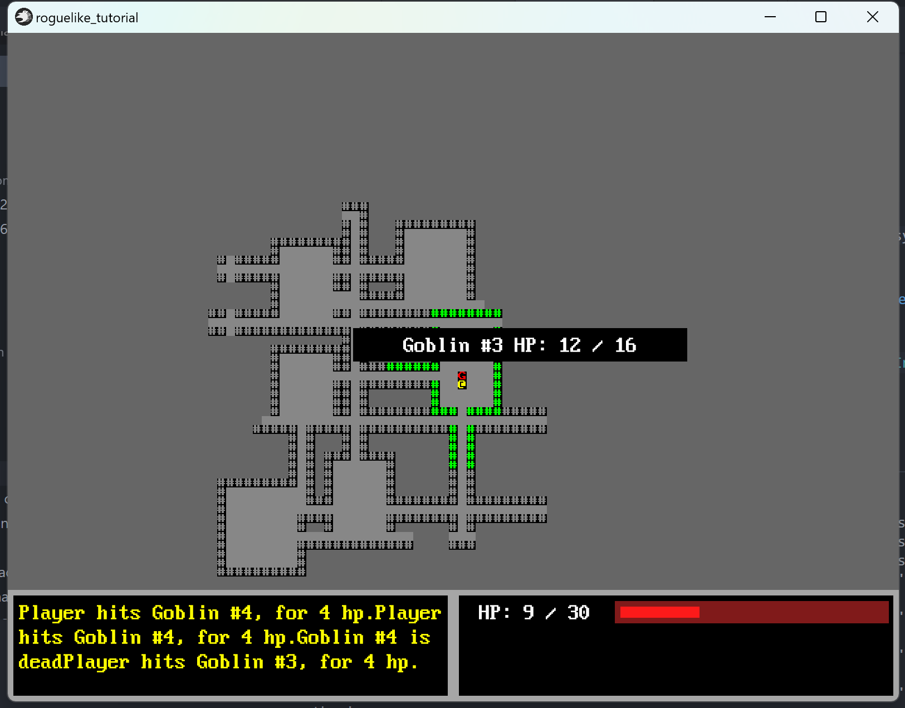

+++
title = "roguelike_chapter8 道具"
date = 2024-04-28

[taxonomies]
tags = ["roguelike", "bevy"]
+++

[bracketproductions](https://bfnightly.bracketproductions.com)的 bevy 实现。
代码仓库: [RoguelikeTutorial](https://github.com/zuiyu1998/RoguelikeTutorial.git)

<!-- more -->

# 添加一个随机数生成器

添加一个随机数生成器，以便生成随机数。代码如下：

```rust
use bracket_random::prelude::RandomNumberGenerator as BracketRandomNumberGenerator;

#[derive(Resource, Deref, DerefMut)]
pub struct RandomNumberGenerator(BracketRandomNumberGenerator);
```

在 common.rs 的 CommomPlugin 添加此资源,代码如下:

```rust
        app.insert_resource(RandomNumberGenerator(BracketRandomNumberGenerator::new()));

```

# 添加 spawner

在 src/spawner.rs 中添加专门的函数生成怪物，玩家。
先自定义一个参数 ThemeContext，代码如下:

```rust
#[derive(SystemParam)]
pub struct ThemeContext<'w> {
    pub texture_assets: ResMut<'w, TextureAssets>,
    pub layout_assets: ResMut<'w, Assets<TextureAtlasLayout>>,
    pub theme: ResMut<'w, Theme>,
}
```

ThemeContext 保存一些玩家和敌人的图像资源。
在 src/spawner.rs 中添加 player 函数。代码如下:

```rust
pub fn player(commands: &mut Commands, theme_context: &mut ThemeContext, x: i32, y: i32) -> Entity {
    let mut sprite_bundle = create_sprite_sheet_bundle(
        &theme_context.texture_assets,
        &mut theme_context.layout_assets,
        theme_context.theme.player_to_render(),
    );
    sprite_bundle.transform.translation.z = PLAYER_Z_INDEX;

    commands
        .spawn((
            sprite_bundle,
            Position { x, y },
            Player,
            Viewshed {
                range: 9,
                visible_tiles: vec![],
                dirty: true,
            },
            Name::new("Player"),
            CombatStats {
                max_hp: 30,
                hp: 30,
                defense: 2,
                power: 5,
            },
        ))
        .id()
}

```

修改 src/logic.rs 中的 setup_game 函数。

在 src/spawner.rs 中添加 enemy 函数 生成敌人。代码如下：

```rust
pub fn enemy(
    commands: &mut Commands,
    theme_context: &mut ThemeContext,
    enemy_tile: EnemyType,
    name: &str,
    x: i32,
    y: i32,
) -> Entity {
    let mut sprite_bundle = create_sprite_sheet_bundle(
        &theme_context.texture_assets,
        &mut theme_context.layout_assets,
        theme_context.theme.enemy_to_render(enemy_tile),
    );

    sprite_bundle.transform.translation.z = ENEMY_Z_INDEX;

    let monster = commands
        .spawn((
            sprite_bundle,
            Position { x, y },
            Enemy,
            Viewshed {
                range: 9,
                visible_tiles: vec![],
                dirty: true,
            },
            Name::new(name.to_owned()),
            BlocksTile,
            CombatStats {
                max_hp: 16,
                hp: 16,
                defense: 1,
                power: 3,
            },
        ))
        .id();

    monster
}


```

在 src/spawner.rs 中添加 goblin 函数 生成 goblin 敌人。代码如下：

```rust
pub fn goblin(
    commands: &mut Commands,
    theme_context: &mut ThemeContext,
    name: &str,
    x: i32,
    y: i32,
) -> Entity {
    let monster = enemy(commands, theme_context, EnemyType::G, name, x, y);

    monster
}

```

在 src/spawner.rs 中添加 orc 函数 生成 orc 敌人。代码如下：

```rust
pub fn orc(
    commands: &mut Commands,
    theme_context: &mut ThemeContext,
    name: &str,
    x: i32,
    y: i32,
) -> Entity {
    let monster = enemy(commands, theme_context, EnemyType::O, name, x, y);

    monster
}

```

注意这里要更改 EnemyType 枚举，需要添加一个新的值 O。

在 src/spawner.rs 中添加 random_monster 函数 随机生成敌人。代码如下：

```rust
pub fn random_enemy(
    commands: &mut Commands,
    theme_context: &mut ThemeContext,
    rng: &mut RandomNumberGenerator,
    x: i32,
    y: i32,
    i: usize,
) -> Entity {
    let roll: i32;
    {
        roll = rng.roll_dice(1, 2);
    }

    match roll {
        1 => {
            let name = format!("Goblin #{}", i);

            return goblin(commands, theme_context, &name, x, y);
        }

        __ => {
            let name = format!("Orc #{}", i);

            return orc(commands, theme_context, &name, x, y);
        }
    }
}

```

修改 setup_game 函数。代码如下:

```rust
fn setup_game(
    mut commands: Commands,
    mut theme_context: ThemeContext,
    mut rng: ResMut<RandomNumberGenerator>,
) {
    let mut map = new_map_rooms_and_corridors();

    map.populate_blocked();

    let map_entity = map.spawn_tiles(
        &mut commands,
        &theme_context.texture_assets,
        &mut theme_context.layout_assets,
        &theme_context.theme,
    );

    let first = map.rooms[0].center();

    let player = spawner::player(&mut commands, &mut theme_context, first.0, first.1);

    commands.entity(player).set_parent(map_entity);

    commands.insert_resource(PlayerPosition(Point::new(first.0, first.1)));

    commands.insert_resource(PlayerEntity(player));

    for (i, room) in map.rooms.iter().skip(1).enumerate() {
        let enemy_pos = room.center();

        let enemy = random_enemy(
            &mut commands,
            &mut theme_context,
            &mut rng,
            enemy_pos.0,
            enemy_pos.1,
            i,
        );

        commands.entity(enemy).set_parent(map_entity);
    }

    commands.insert_resource(MapEntity(map_entity));
    commands.insert_resource(map);
    commands.insert_resource(GameLog::default());
}
```

更改 src/theme.rs 中 DefaultTheme 的 MapTheme trait，适应新的敌人 orc。代码如下:

```rust
fn enemy_to_render(&self, enemy_type: EnemyType) -> Glyph {
        match enemy_type {
            EnemyType::G => Glyph {
                color: Color::RED,
                index: 'G' as usize,
            },
            EnemyType::O => Glyph {
                color: Color::RED,
                index: 'O' as usize,
            },
        }
    }
```

# 在生成的房间内生成多个敌人

在 src/spawner.rs 中添加 spawn_room 函数，管理房间内生成的敌人。代码如下:

```rust
pub fn spawn_room(
    commands: &mut Commands,
    theme_context: &mut ThemeContext,
    map_entity: Entity,
    rng: &mut RandomNumberGenerator,
    room: &Rect,
    room_index: usize,
    max_enemy: usize,
) {
    let mut monster_spawn_points: Vec<Position> = Vec::new();

    let num_monsters = rng.roll_dice(1, max_enemy as i32 + 2) - 3;

    for _i in 0..num_monsters {
        let mut added = false;
        while !added {
            let x = room.x1 + rng.roll_dice(1, i32::abs(room.x2 - room.x1));
            let y = room.y1 + rng.roll_dice(1, i32::abs(room.y2 - room.y1));

            let pos = Position { x, y };

            if !monster_spawn_points.contains(&pos) {
                monster_spawn_points.push(pos);
                added = true;
            }
        }
    }

    for (room_enemy_index, pos) in monster_spawn_points.iter().enumerate() {
        let enemy_index = room_index * max_enemy + room_enemy_index;

        let enemy = random_enemy(commands, theme_context, rng, pos.x, pos.y, enemy_index);

        commands.entity(enemy).set_parent(map_entity);
    }
}
```

更新 setup_game 函数。代码如下:

```rust
fn setup_game(
    mut commands: Commands,
    mut theme_context: ThemeContext,
    mut rng: ResMut<RandomNumberGenerator>,
) {
    let mut map = new_map_rooms_and_corridors();

    map.populate_blocked();

    let map_entity = map.spawn_tiles(
        &mut commands,
        &theme_context.texture_assets,
        &mut theme_context.layout_assets,
        &theme_context.theme,
    );

    let first = map.rooms[0].center();

    let player = spawner::player(&mut commands, &mut theme_context, first.0, first.1);

    commands.entity(player).set_parent(map_entity);

    commands.insert_resource(PlayerPosition(Point::new(first.0, first.1)));

    commands.insert_resource(PlayerEntity(player));

    for (i, room) in map.rooms.iter().skip(1).enumerate() {
        spawn_room(
            &mut commands,
            &mut theme_context,
            map_entity,
            &mut rng,
            room,
            i,
            4,
        )
    }

    commands.insert_resource(MapEntity(map_entity));
    commands.insert_resource(map);
    commands.insert_resource(GameLog::default());
}
```

运行代码，右键左上角的按钮，点击 playing，右键左上角的按钮，会出现下图界面。


# 添加生命药水

在 src/item/mod.rs 中新增 item 组件和 Potion 组件以及 ItemType 类型。代码如下:

```rust
#[derive(Component, Debug)]
pub struct Item {}

//生命药水
#[derive(Component, Debug)]
pub struct Potion {
    pub heal_amount: i32,
}

pub enum ItemType {
    HealthPotion,
}
```

ItemType 表示道具类型。
修改 src/thmem.rs 中的 MapTheme trait，添加一个函数 item_to_render。代码如下:

```rust
pub trait MapTheme: 'static + Sync + Send {
    fn tile_to_render(&self, tile_type: TileType) -> Glyph;
    fn item_to_render(&self, tile_type: ItemType) -> Glyph;

    fn revealed_tile_to_render(&self, tile_type: TileType) -> Glyph;

    fn player_to_render(&self) -> Glyph;

    fn enemy_to_render(&self, enemy_type: EnemyType) -> Glyph;
}
```

添加 DefaultTheme 的 Map trait 实现，代码如下:

```rust
    fn item_to_render(&self, item_type: ItemType) -> Glyph {
        match item_type {
            ItemType::HealthPotion => Glyph {
                color: Color::PURPLE,
                index: '¡' as usize,
            },
        }
    }
```

在 src/consts.rs 新增一个 ITEM_Z_INDEX,代码如下:

```rust
pub const ITEM_Z_INDEX: f32 = 8.0;

```

在 src/spawner.rs 中新增一个函数 health_potion，用来生成生命药水的实体。代码如下：

```rust
pub fn health_potion(
    commands: &mut Commands,
    theme_context: &mut ThemeContext,
    x: i32,
    y: i32,
) -> Entity {
    let mut sprite_bundle = create_sprite_sheet_bundle(
        &theme_context.texture_assets,
        &mut theme_context.layout_assets,
        theme_context.theme.item_to_render(ItemType::HealthPotion),
    );
    sprite_bundle.transform.translation.z = ITEM_Z_INDEX;

    commands
        .spawn((
            sprite_bundle,
            Position { x, y },
            Name::new("Item"),
            Item {},
            Potion { heal_amount: 10 },
        ))
        .id()
}
```

更改 spawn_room 函数，在生成敌人的同时生成生命药水。代码如下:

```rust
pub fn spawn_room(
    commands: &mut Commands,
    theme_context: &mut ThemeContext,
    map_entity: Entity,
    rng: &mut RandomNumberGenerator,
    room: &Rect,
    room_index: usize,
    max_enemy: usize,
    max_item: usize,
) {
    let mut monster_spawn_points: Vec<Position> = Vec::new();
    let mut item_spawn_points: Vec<Position> = Vec::new();

    let num_monsters = rng.roll_dice(1, max_enemy as i32 + 2) - 3;
    let num_items = rng.roll_dice(1, max_item as i32 + 2) - 3;

    for _i in 0..num_monsters {
        let mut added = false;
        while !added {
            let x = room.x1 + rng.roll_dice(1, i32::abs(room.x2 - room.x1));
            let y = room.y1 + rng.roll_dice(1, i32::abs(room.y2 - room.y1));

            let pos = Position { x, y };

            if !monster_spawn_points.contains(&pos) {
                monster_spawn_points.push(pos);
                added = true;
            }
        }
    }

    for _i in 0..num_items {
        let mut added = false;
        while !added {
            let x = room.x1 + rng.roll_dice(1, i32::abs(room.x2 - room.x1));
            let y = room.y1 + rng.roll_dice(1, i32::abs(room.y2 - room.y1));
            let pos = Position { x, y };

            if !item_spawn_points.contains(&pos) {
                item_spawn_points.push(pos);
                added = true;
            }
        }
    }

    for (room_enemy_index, pos) in monster_spawn_points.iter().enumerate() {
        let enemy_index = room_index * max_enemy + room_enemy_index;

        let enemy = random_enemy(commands, theme_context, rng, pos.x, pos.y, enemy_index);

        commands.entity(enemy).set_parent(map_entity);
    }

    for pos in monster_spawn_points.iter() {
        let item_entity = health_potion(commands, theme_context, pos.x, pos.y);

        commands.entity(item_entity).set_parent(map_entity);
    }
}
```

# 让玩家可以拾取道具

在 src/item/mod.rs 中新建一个 InBackpack 组件,这个组件用来标识道具在背包中。代码如下:

```rust
#[derive(Component, Debug, Clone)]
pub struct InBackpack {
    pub owner: Entity,
}
```

类似于战斗系统的设计，这里需要设计一个组件，包含实际要获取的实体和物品实体。代码如下:

```rust
#[derive(Component, Debug, Clone)]
pub struct WantsToPickupItem {
    pub collected_by : Entity,
    pub item : Entity
}
```

在 src/item/mod.rs 中新增一个物品收集系统，代码如下:

```rust
pub fn item_collect(
    mut commands: Commands,
    q_wants_to_pickup_item: Query<(&Parent, Entity, &WantsToPickupItem)>,
    q_items: Query<Entity, (With<Item>, Without<InBackpack>)>,
) {
    for (parent, wants_to_pickup_item_entity, wants_to_pickup_item) in q_wants_to_pickup_item.iter()
    {
        if let Ok(_) = q_items.get(wants_to_pickup_item.item) {
            commands
                .entity(wants_to_pickup_item.item)
                .insert(InBackpack {
                    owner: parent.get(),
                })
                .remove::<SpriteSheetBundle>()
                .remove::<Position>()
                .set_parent(wants_to_pickup_item.collected_by);

            commands
                .entity(wants_to_pickup_item_entity)
                .despawn_recursive();
        }
    }
}
```

新建一个 ItemPlugin 实现，同时添加 item_collect 系统的调度。代码如下:

```rust
impl Plugin for ItemPlugin {
    fn build(&self, app: &mut App) {
        app.add_systems(Update, item_collect.run_if(in_state(GameState::Playing)));
    }
}

```

记得将 ItemPlugin 放入 lib/GamePlugin 中。

# 玩家拾取道具

首先在 Map 上新增一个 items 的字段存储道具数据。代码如下:

```rust
pub struct Map {
    pub width: i32,
    pub height: i32,
    pub tiles: Vec<TileType>,
    pub revealed_tiles: Vec<bool>,
    pub rooms: Vec<Rect>,
    pub visible_tiles: Vec<bool>,
    pub blocked: Vec<bool>,
    pub tile_content: Vec<Vec<Entity>>,
    pub items: Vec<Option<Entity>>,
}
```

更改 map 的 populate_blocked 函数为 populate，同时更改实现,添加填充道具数据，代码如下:

```rust
    pub fn populate(&mut self) {
        for (i, tile) in self.tiles.iter_mut().enumerate() {
            self.blocked[i] = *tile == TileType::Wall;
            self.items[i] = None;
        }
    }

```

修改 src/map.rs 中 map_index 系统，添加所有的道具信息。代码如下:

```rust
pub fn map_index(
    q_position: Query<Entity, With<Enemy>>,
    q_blocks: Query<(&Position, Entity), With<BlocksTile>>,
    q_items: Query<(&Position, Entity), (With<Item>, Without<InBackpack>)>,
    mut map: ResMut<Map>,
) {
    map.populate();
    map.clear_content_index();

    for (pos, entity) in q_blocks.iter() {
        let idx = map.xy_idx(pos.x, pos.y);
        map.blocked[idx] = true;

        if let Ok(_) = q_position.get(entity) {
            map.tile_content[idx].push(entity);
        }
    }

    for (pos, entity) in q_items.iter() {
        let idx = map.xy_idx(pos.x, pos.y);
        map.items[idx] = Some(entity);
    }
}
```

修改 src/player.rs 中 player_input 系统，如果下一个位置有道具，玩家将会拾取道具。代码如下:

```rust
pub fn player_input(
    keyboard_input: Res<ButtonInput<KeyCode>>,
    mut q_player: Query<&mut Position, With<Player>>,
    mut player_position: ResMut<PlayerPosition>,
    player_entity: Res<PlayerEntity>,
    map: Res<Map>,
    q_combat_stats: Query<&mut CombatStats>,
    mut commands: Commands,
    mut run_turn_ns: ResMut<NextState<RunTurnState>>,
) {
    let mut pos = match q_player.get_single_mut() {
        Ok(pos) => pos,
        Err(_) => return,
    };

    let input = get_input(&keyboard_input);

    let new_pos_x = pos.x + input.x as i32;
    let new_pos_y = pos.y + input.y as i32;

    let index = map.xy_idx(new_pos_x, new_pos_y);

    for potential_target in map.tile_content[index].iter() {
        let target = q_combat_stats.get(*potential_target);
        match target {
            Err(_e) => {
                error!("tile content index error,entity is :{:?}", potential_target);
            }
            Ok(_t) => {
                // Attack it
                info!("From Hell's Heart, I stab thee!");

                let entity = *potential_target;
                //生成子实体添加攻击组件
                commands.entity(player_entity.0).with_children(|parent| {
                    parent.spawn(WantsToMelee { target: entity });
                });

                return; // So we don't move after attacking
            }
        }
    }

    if map.blocked[index] {
        return;
    }
    if let Some(item_entity) = map.items[index] {
        commands.entity(player_entity.0).with_children(|parent| {
            parent.spawn(WantsToPickupItem {
                collected_by: player_entity.0,
                item: item_entity,
            });
        });
    }

    pos.x = new_pos_x;
    pos.y = new_pos_y;

    player_position.0 = Point::new(new_pos_x, new_pos_y);

    if !input.x.is_zero() {
        run_turn_ns.set(RunTurnState::PlayerTurn);
    }
}
```

# 致谢

- [bevy](https://github.com/bevyengine/bevy),游戏引擎
- [bevy_game_template](https://github.com/NiklasEi/bevy_game_template.git),游戏模板
- [bevy_ascii_terminal](https://github.com/sarkahn/bevy_ascii_terminal),字符显示
- [bevy_editor_pls](https://github.com/jakobhellermann/bevy_editor_pls),可视化编辑器
- [bracket-random](https://github.com/amethyst/bracket-lib)，随机数生成器
- [bracket-pathfinding](https://github.com/amethyst/bracket-lib) 寻路
- [BevyRoguelike](https://github.com/thephet/BevyRoguelike) bevy 实现版本
