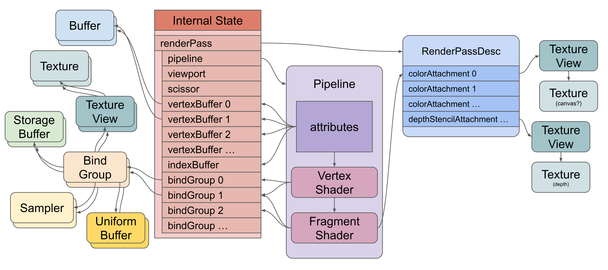
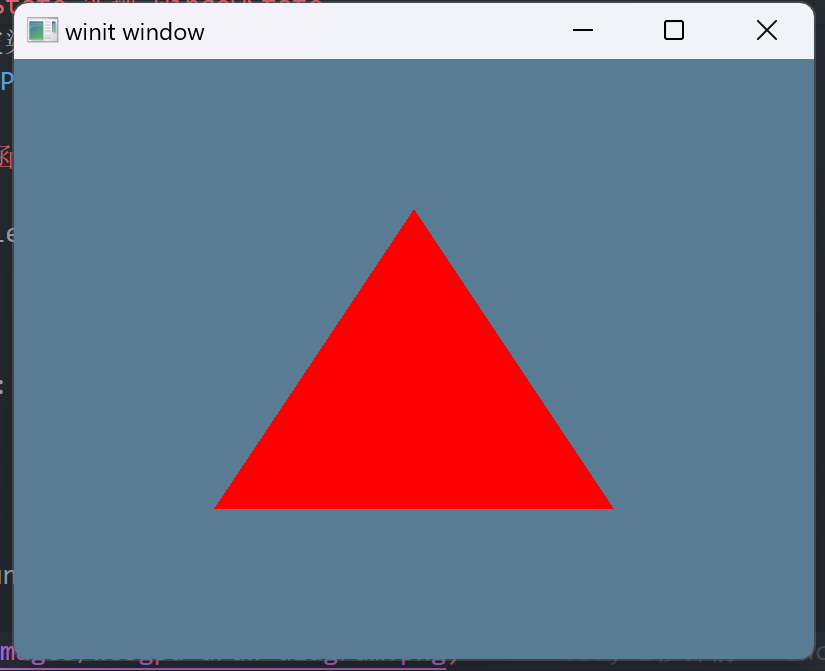

+++
title = "webgpu 基础"
date = 2024-04-26

[taxonomies]
tags = ["webgpu", "rust"]
+++

webgpu 教程的 rust 实现版，[原教程](https://webgpufundamentals.org/webgpu/lessons/zh_cn/webgpu-fundamentals.html)。

[项目地址](https://github.com/zuiyu1998/webgpu-demo.git)

<!-- more -->

# webgpu 是什么

WebGPU 是一个应用程序接口，可让您做两件基本的事情。

- 绘制三角形/点/线到纹理上
- 在 GPU 上进行计算

直接使用它能做的事情并不多，只有在更高的抽象库上才能更方便的使用它。比如 bevy render。
只有好奇它是如何工作的。在这种情况下，才需要继续。

# 起步

从某种程度上说，WebGPU 是一个非常简单的系统。它所做的就是在 GPU 上运行 3 种功能：顶点着色器、片段着色器和计算着色器。

顶点着色器负责计算顶点。着色器会返回顶点位置。对于每组 3 个顶点，它会返回在这 3 个位置之间绘制的三角形 [1]

片段着色器负责计算颜色 [2]。 在绘制三角形时，GPU 会为每个要绘制的像素调用片段着色器。片段着色器会返回一种颜色。

而计算着色器则更加的通用。它实际上只是一个函数，你调用它，然后说 “执行这个函数 N 次”。GPU 每次调用你的函数时都会传递迭代次数，因此你可以在每次迭代时使用该次数做一些独特的事情。

在 GPU 上运行的函数只是函数，就像 rust 函数一样。不同之处在于它们是在 GPU 上运行的，因此要运行它们，您需要以缓冲区和纹理的形式将您希望它们访问的所有数据复制到 GPU 上，而且它们只能输出到这些缓冲区和纹理。您需要在函数中指定函数将在哪些绑定或位置查找数据。回到 rust 中，你需要将保存数据的缓冲区和纹理绑定到这些绑定或位置。一旦完成这些后，您就可以告诉 GPU 执行函数了。
也许下面的图片会有所帮助。以下是使用顶点着色器和片段着色器绘制三角形的 WebGPU 设置简图

上图的注意事项：

- 管道(Pipeline). 它包含 GPU 将运行的顶点着色器和片段着色器。您也可以在管道(Pipeline)中加入计算着色器
- 着色器通过**绑定组(Bind Groups)**间接引用资源（缓冲区(buffer)、纹理(texture)、采样器(sampler)）
- 管道定义了通过内部状态间接引用缓冲区的属性
- 属性从缓冲区中提取数据，并将数据输入顶点着色器
- 顶点着色器可将数据输入片段着色器
- 片段着色器通过 render pass description 间接写入纹理

要在 GPU 上执行着色器，需要创建所有这些资源并设置状态。创建资源相对简单。有趣的是，大多数 WebGPU 资源在创建后都无法更改。您可以更改它们的内容，但是无法更改它们的大小、用途、格式等等。如果要更改这些内容，需要创建一个新资源并销毁旧资源。

有些状态是通过创建和执行命令缓冲区来设置的。命令缓冲区顾名思义。它们是一个命令缓冲区。你可以创建编码器。编码器将命令编码到命令缓冲区。编码器完成(finish)编码后，就会向你提供它创建的命令缓冲区。然后，您就可以提交(submit)该命令缓冲区，让 WebGPU 执行命令。

现在开始实现 webgpu 的两个功能，绘制三角形和在 gpu 上计算。

# 新建项目

使用 cargo new webgpu-demo 新建一个项目。为项目添加依赖，代码如下:

```rust
[dependencies]
wgpu = "0.19"
winit = "0.29"

env_logger = "0.11"
log = "0.4"
pollster = "0.3"
async-trait = "0.1"
```

# 添加 WindowState trait

在 src/lib.rs 中添加 WindowState trait。WindowState trait 声明的代码如下：

```rust
#[async_trait]
pub trait WindowState {
    async fn new(window: Window) -> Self;//1

    fn window(&self) -> &Window;//2

    fn resize(&mut self, new_size: winit::dpi::PhysicalSize<u32>);//3

    fn size(&self) -> winit::dpi::PhysicalSize<u32>;//4

    fn update(&mut self) {}//4

    fn input(&mut self, _event: &WindowEvent) -> bool {//5
        false
    }

    fn render(&mut self) -> Result<(), wgpu::SurfaceError> {//6
        Ok(())
    }
}
```

new 函数根据 Window 获取 webgpu 相关对象。resize 函数根据窗口调整渲染窗口大小。size 函数返回当前窗口大小，input 判断是否处理 WindowEvent，render 是向 gpu 发送命令的入口。update 更新一些必要的信息。

# 添加 State

在 src/lib.rs 中新增定义 State,代码如下:

```rust
pub struct State {
    pub surface: wgpu::Surface<'static>,
    pub device: wgpu::Device,
    pub queue: wgpu::Queue,
    pub config: wgpu::SurfaceConfiguration,
    pub size: winit::dpi::PhysicalSize<u32>,
    // The window must be declared after the surface so
    // it gets dropped after it as the surface contains
    // unsafe references to the window's resources.
    pub window: Window,
}
```

surface 为窗口纹理，是所看到的主要对象。config 是 surface 的配置。device 和 queue 是 wgpu 中的对象。size 和 window 是 winit 中关于窗口的一些抽象。

# 为 State 实现 WindowState

在 src/lib.rs 中为 State 实现 WindowState 代码如下:

```rust
#[async_trait]
impl WindowState for State {
    async fn new(window: Window) -> Self {
        let size = window.inner_size();

        // The instance is a handle to our GPU
        // Backends::all => Vulkan + Metal + DX12 + Browser WebGPU
        let instance = wgpu::Instance::new(wgpu::InstanceDescriptor {
            backends: wgpu::Backends::all(),
            ..Default::default()
        });

        // SAFETY: The window handles in ExtractedWindows will always be valid objects to create surfaces on
        let surface = unsafe {
            let surface_target = wgpu::SurfaceTargetUnsafe::from_window(&window).unwrap();
            // NOTE: On some OSes this MUST be called from the main thread.
            // As of wgpu 0.15, only fallible if the given window is a HTML canvas and obtaining a WebGPU or WebGL2 context fails.
            instance
                .create_surface_unsafe(surface_target)
                .expect("Failed to create wgpu surface")
        };
        let adapter = instance
            .request_adapter(&wgpu::RequestAdapterOptions {
                power_preference: wgpu::PowerPreference::default(),
                compatible_surface: Some(&surface),
                force_fallback_adapter: false,
            })
            .await
            .unwrap();

        let (device, queue) = adapter
            .request_device(
                &wgpu::DeviceDescriptor {
                    required_features: wgpu::Features::empty(),
                    // WebGL doesn't support all of wgpu's features, so if
                    // we're building for the web, we'll have to disable some.
                    required_limits: wgpu::Limits::default(),
                    label: None,
                },
                None, // Trace path
            )
            .await
            .unwrap();

        let surface_caps = surface.get_capabilities(&adapter);
        // Shader code in this tutorial assumes an sRGB surface texture. Using a different
        // one will result in all the colors coming out darker. If you want to support non
        // sRGB surfaces, you'll need to account for that when drawing to the frame.
        let surface_format = surface_caps
            .formats
            .iter()
            .copied()
            .filter(|f| f.is_srgb())
            .next()
            .unwrap_or(surface_caps.formats[0]);
        let config = wgpu::SurfaceConfiguration {
            usage: wgpu::TextureUsages::RENDER_ATTACHMENT,
            format: surface_format,
            width: size.width,
            height: size.height,
            present_mode: surface_caps.present_modes[0],
            alpha_mode: surface_caps.alpha_modes[0],
            view_formats: vec![],
            desired_maximum_frame_latency: 2,
        };
        surface.configure(&device, &config);

        Self {
            window,
            surface,
            device,
            queue,
            config,
            size,
        }
    }

    fn window(&self) -> &Window {
        &self.window
    }

    fn size(&self) -> winit::dpi::PhysicalSize<u32> {
        self.size
    }

    fn resize(&mut self, new_size: winit::dpi::PhysicalSize<u32>) {
        if new_size.width > 0 && new_size.height > 0 {
            self.size = new_size;
            self.config.width = new_size.width;
            self.config.height = new_size.height;
            self.surface.configure(&self.device, &self.config);
        }
    }

    fn input(&mut self, _event: &WindowEvent) -> bool {
        false
    }
}
```

这里最重要的是 new 函数，它负责初始化 webgpu 的一些资源。

```rust
    let instance = wgpu::Instance::new(wgpu::InstanceDescriptor {
            backends: wgpu::Backends::all(),
            ..Default::default()
        });
```

instance 为 webgpu 的实例，主要负责创建 adapter 和 surface。

```rust
   let surface = unsafe {
            let surface_target = wgpu::SurfaceTargetUnsafe::from_window(&window).unwrap();
            // NOTE: On some OSes this MUST be called from the main thread.
            // As of wgpu 0.15, only fallible if the given window is a HTML canvas and obtaining a WebGPU or WebGL2 context fails.
            instance
                .create_surface_unsafe(surface_target)
                .expect("Failed to create wgpu surface")
        };
```

这里根据 winit 的窗口对象创建了一个可用的 surface。

```rust
let adapter = instance
            .request_adapter(&wgpu::RequestAdapterOptions {
                power_preference: wgpu::PowerPreference::default(),
                compatible_surface: Some(&surface),
                force_fallback_adapter: false,
            })
            .await
            .unwrap();

        let (device, queue) = adapter
            .request_device(
                &wgpu::DeviceDescriptor {
                    required_features: wgpu::Features::empty(),
                    // WebGL doesn't support all of wgpu's features, so if
                    // we're building for the web, we'll have to disable some.
                    required_limits: wgpu::Limits::default(),
                    label: None,
                },
                None, // Trace path
            )
            .await
            .unwrap();
```

这里初始化了 State 中 device 和 queue。device 用来创建各种资源，queue 为 Gpu 的渲染队列，只有提交给 queue，Gpu 才会执行。

```rust
       let surface_caps = surface.get_capabilities(&adapter);
        // Shader code in this tutorial assumes an sRGB surface texture. Using a different
        // one will result in all the colors coming out darker. If you want to support non
        // sRGB surfaces, you'll need to account for that when drawing to the frame.
        let surface_format = surface_caps
            .formats
            .iter()
            .copied()
            .filter(|f| f.is_srgb())
            .next()
            .unwrap_or(surface_caps.formats[0]);
        let config = wgpu::SurfaceConfiguration {
            usage: wgpu::TextureUsages::RENDER_ATTACHMENT,
            format: surface_format,
            width: size.width,
            height: size.height,
            present_mode: surface_caps.present_modes[0],
            alpha_mode: surface_caps.alpha_modes[0],
            view_formats: vec![],
            desired_maximum_frame_latency: 2,
        };
        surface.configure(&device, &config);
```

这里初始化了 surface 大小和相关配置。

# 添加 run 函数

在 src/lib.rs 中新增 run 函数，代码如下:

```rust
pub async fn run<S>()
where
    S: WindowState,
{
    env_logger::init();
    let event_loop = EventLoop::new().unwrap();
    let window = WindowBuilder::new().build(&event_loop).unwrap();

    let mut state = S::new(window).await;

    event_loop
        .run(move |event, evet_loop_target| match event {
            Event::WindowEvent {
                ref event,
                window_id,
            } if window_id == state.window().id() => {
                if !state.input(event) {
                    match event {
                        WindowEvent::CloseRequested => evet_loop_target.exit(),
                        WindowEvent::Resized(physical_size) => {
                            state.resize(*physical_size);
                        }
                        WindowEvent::RedrawRequested => {
                            state.update();
                            match state.render() {
                                Ok(_) => {}
                                // Reconfigure the surface if lost
                                Err(wgpu::SurfaceError::Lost) => state.resize(state.size()),
                                // The system is out of memory, we should probably quit
                                Err(wgpu::SurfaceError::OutOfMemory) => evet_loop_target.exit(),
                                // All other errors (Outdated, Timeout) should be resolved by the next frame
                                Err(e) => eprintln!("{:?}", e),
                            }
                        }
                        _ => {}
                    }
                }
            }

            _ => {}
        })
        .unwrap();
}
```

run 函数为整个程序的入口函数，event_loop 为主程序的 loop 循环，它会执行 WindowState trait 的各种方法。

# 渲染一个三角形

在前置工作完成后，在 src/examples/chapter1.rs 中新增 ChapterState，它的定义如下:

```rust
pub struct ChapterState {
    pub state: State,

    render_pipeline: wgpu::RenderPipeline,
}

```

render_pipeline 是本次渲染三角形需要的管道。在实现 windowState trait 之前，先实现需要的 wgsl。

# 添加 wgsl

在 src/examples/中添加 shader.wgsl，代码如下:

```wgsl
@vertex fn vs(
@builtin(vertex_index) vertexIndex : u32
) -> @builtin(position) vec4f {

let x = f32(1 - i32(vertexIndex)) * 0.5;
let y = f32(i32(vertexIndex & 1u) * 2 - 1) * 0.5;

return vec4f(x, y, 0.0, 1.0);
}

@fragment fn fs() -> @location(0) vec4f {
return vec4f(1.0, 0.0, 0.0, 1.0);
}
```

这里添加了一个 vs 的顶点着色器和 fs 的片段着色器。顶点着色器 vs 使用@builtin(vertex_index)作为输入，vertex_index 指的是渲染的次数。这里 vertex_index 会从 0 到 2。这个 vs 的逻辑就是返回三角形的三个顶点。更多 builtin 变量可访问https://gpuweb.github.io/gpuweb/wgsl/#builtin-inputs-outputs。
片元着色器 fs 的逻辑更为简单,就是返回一个固定的值。

# 为 ChapterState 实现 WindowState

在 src/examples/chapter1.rs 中为 ChapterState 实现 WindowState trait。代码如下:

```rust
    async fn new(window: Window) -> Self {
        let mut state = State::new(window).await;

        let render_pipeline = Self::create_render_pipeline(&mut state);

        ChapterState {
            state,
            render_pipeline,
        }
    }

impl ChapterState {
    fn create_render_pipeline(state: &mut State) -> wgpu::RenderPipeline {
        let shader = state
            .device
            .create_shader_module(wgpu::ShaderModuleDescriptor {
                label: Some("our hardcoded red triangle shaders"),
                source: wgpu::ShaderSource::Wgsl(include_str!("shader.wgsl").into()),
            });
        let render_pipeline_layout =
            state
                .device
                .create_pipeline_layout(&wgpu::PipelineLayoutDescriptor {
                    label: Some("Render Pipeline Layout"),
                    bind_group_layouts: &[],
                    push_constant_ranges: &[],
                });

        let render_pipeline =
            state
                .device
                .create_render_pipeline(&wgpu::RenderPipelineDescriptor {
                    label: Some("our hardcoded red triangle pipeline"),
                    layout: Some(&render_pipeline_layout),
                    vertex: wgpu::VertexState {
                        module: &shader,
                        entry_point: "vs", // 1.
                        buffers: &[],      // 2.
                    },
                    fragment: Some(wgpu::FragmentState {
                        // 3.
                        module: &shader,
                        entry_point: "fs",
                        targets: &[Some(wgpu::ColorTargetState {
                            // 4.
                            format: state.config.format,
                            blend: Some(wgpu::BlendState::REPLACE),
                            write_mask: wgpu::ColorWrites::ALL,
                        })],
                    }),
                    primitive: wgpu::PrimitiveState {
                        topology: wgpu::PrimitiveTopology::TriangleList, // 1.
                        strip_index_format: None,
                        front_face: wgpu::FrontFace::Ccw, // 2.
                        cull_mode: Some(wgpu::Face::Back),
                        // Setting this to anything other than Fill requires Features::NON_FILL_POLYGON_MODE
                        polygon_mode: wgpu::PolygonMode::Fill,
                        // Requires Features::DEPTH_CLIP_CONTROL
                        unclipped_depth: false,
                        // Requires Features::CONSERVATIVE_RASTERIZATION
                        conservative: false,
                    },
                    depth_stencil: None, // 1.
                    multisample: wgpu::MultisampleState {
                        count: 1,                         // 2.
                        mask: !0,                         // 3.
                        alpha_to_coverage_enabled: false, // 4.
                    },
                    multiview: None, // 5.
                });

        render_pipeline
    }
}
```

注意 new 为 WindowState trait 的实现。这里主要关注的是 create_render_pipeline 的实现，如何创建一个管道。

```rust
  let shader = state
            .device
            .create_shader_module(wgpu::ShaderModuleDescriptor {
                label: Some("our hardcoded red triangle shaders"),
                source: wgpu::ShaderSource::Wgsl(include_str!("shader.wgsl").into()),
            });
```

首先通过 device 的 create_shader_module 方法创建所需要的 shader 。

```rust
      let render_pipeline_layout =
            state
                .device
                .create_pipeline_layout(&wgpu::PipelineLayoutDescriptor {
                    label: Some("Render Pipeline Layout"),
                    bind_group_layouts: &[],
                    push_constant_ranges: &[],
                });
```

通过 device 的 create_pipeline_layout 方法创建所需要的管道布局，因为在 wgsl 中未使用其他变量，bind_group_layouts 为空。

```rust
let render_pipeline =
            state
                .device
                .create_render_pipeline(&wgpu::RenderPipelineDescriptor {
                    label: Some("our hardcoded red triangle pipeline"),
                    layout: Some(&render_pipeline_layout),
                    vertex: wgpu::VertexState {
                        module: &shader,
                        entry_point: "vs", // 1.
                        buffers: &[],      // 2.
                    },
                    fragment: Some(wgpu::FragmentState {
                        // 3.
                        module: &shader,
                        entry_point: "fs",
                        targets: &[Some(wgpu::ColorTargetState {
                            // 4.
                            format: state.config.format,
                            blend: Some(wgpu::BlendState::REPLACE),
                            write_mask: wgpu::ColorWrites::ALL,
                        })],
                    }),
                    primitive: wgpu::PrimitiveState {
                        topology: wgpu::PrimitiveTopology::TriangleList, // 1.
                        strip_index_format: None,
                        front_face: wgpu::FrontFace::Ccw, // 2.
                        cull_mode: Some(wgpu::Face::Back),
                        // Setting this to anything other than Fill requires Features::NON_FILL_POLYGON_MODE
                        polygon_mode: wgpu::PolygonMode::Fill,
                        // Requires Features::DEPTH_CLIP_CONTROL
                        unclipped_depth: false,
                        // Requires Features::CONSERVATIVE_RASTERIZATION
                        conservative: false,
                    },
                    depth_stencil: None, // 1.
                    multisample: wgpu::MultisampleState {
                        count: 1,                         // 2.
                        mask: !0,                         // 3.
                        alpha_to_coverage_enabled: false, // 4.
                    },
                    multiview: None, // 5.
                });
```

通过 device 的 create_render_pipeline 方法创建管道，这里主要是要配置 RenderPipelineDescriptor。
vertex 表示配置的顶点着色器，module 为创建的着色器模块，entry_point 为顶点着色器的入口。buffers 为顶点数据，这里不需要。
fragment 表示配置的片元着色器，module 为创建的着色器模块，entry_point 为片元着色器的入口。
targets 告诉 gpu 设置什么样的颜色输出，在后面的章节会更细致的学习。
primitive 描述怎么将顶点数据转化为三角形。PrimitiveTopology::TriangleList 表示 3 个顶点为一个三角形。其他字段会在后面学习。
depth_stencil，multisample，multiview 这些字段会在后面学习如何使用。

实现 render 方法。代码如下:

```rust
fn render(&mut self) -> Result<(), wgpu::SurfaceError> {
        let output = self.state.surface.get_current_texture()?;
        let view = output
            .texture
            .create_view(&wgpu::TextureViewDescriptor::default());
        let mut encoder =
            self.state
                .device
                .create_command_encoder(&wgpu::CommandEncoderDescriptor {
                    label: Some("our encoder"),
                });
        {
            let mut render_pass = encoder.begin_render_pass(&wgpu::RenderPassDescriptor {
                label: Some("our basic canvas renderPass"),
                color_attachments: &[
                    // This is what @location(0) in the fragment shader targets
                    Some(wgpu::RenderPassColorAttachment {
                        view: &view,
                        resolve_target: None,
                        ops: wgpu::Operations {
                            load: wgpu::LoadOp::Clear(wgpu::Color {
                                r: 0.1,
                                g: 0.2,
                                b: 0.3,
                                a: 1.0,
                            }),
                            store: wgpu::StoreOp::Store,
                        },
                    }),
                ],
                depth_stencil_attachment: None,
                timestamp_writes: None,
                occlusion_query_set: None,
            });

            render_pass.set_pipeline(&self.render_pipeline);

            render_pass.draw(0..3, 0..1);
        }

        self.state.queue.submit(std::iter::once(encoder.finish()));
        output.present();

        Ok(())
    }
```

render 方法中创建了一个 render_pass，通过 encoder 编码 render_pass 后传递给 queue，实现了页面渲染。
render_pass 由 encoder 的 begin_render_pass 生成，主要是配置 RenderPassDescriptor。
RenderPassDescriptor 主要依赖两个参数 TextureView 和管道。管道已经在 new 函数生成。TextureView 依赖于 sureface。也就是如下的代码:

```rust
    let output = self.state.surface.get_current_texture()?;
        let view = output
            .texture
            .create_view(&wgpu::TextureViewDescriptor::default());
```

再次看三角形渲染设置简图


# 添加 main 函数

在 src/examples/chapter1.rs 中添加主函数。代码如下:

```rust
fn main() {
    pollster::block_on(run::<ChapterState>());
}

```

运行 cargo run --example chapter1,可以看到下图。


